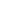

import { Aside } from '@astrojs/starlight/components';

Bifrost ships as three coordinated artifacts — the **API server**, the **bifrost CLI**, and the **web client** — and they need to stay roughly in step. This page documents how versions are surfaced and how the CLI guards against running against an API it doesn't understand.

## Where the version lives

### API server (`BIFROST_VERSION` env var)

The API container is built with a `BIFROST_VERSION` env var (set by the release pipeline to the git tag, e.g. `v2.1.0`). At runtime, the API reads this value and returns it from `GET /api/version`:

```bash
curl https://your-bifrost.example.com/api/version
```

```json
{
  "version": "v2.1.0",
  "min_cli_version": "2.0.0"
}
```

If `BIFROST_VERSION` isn't set (typical for local development), the API falls back to `git describe --tags --always --dirty` from the repo working tree. If neither is available the version reports as `unknown`.

### CLI (`--version` / `-V`)

```bash
bifrost --version
# bifrost 2.1.0
```

The flag short-circuits before any other CLI logic, so it works even when the CLI can't reach an API.

### Web client (sidebar / footer)

The version is printed in the user dropdown in the top-right of the app. Click it to copy the version string to your clipboard — handy when filing bug reports.



The client reads its version from `VITE_BIFROST_VERSION` at build time. If that env var isn't set during the Vite build, the menu displays `unknown`.

## CLI ↔ API compatibility check

Every CLI invocation issues a fast `GET /api/version` against the configured API and compares the response's `min_cli_version` to its own installed version. If the CLI is older than `min_cli_version`, you see this warning on stderr:

```
Warning: CLI version 1.9.2 is older than the minimum required by the API (2.0.0).
Some commands may fail. Upgrade with: pip install -U bifrost-cli
```

The command **still runs** — the check is a soft warning. But functions that depend on newer endpoints will return 4xx and the CLI will surface those errors per-command.

The check is best-effort — if there's no network, the API URL is misconfigured, or the response is malformed, the CLI silently skips the check rather than block your shell.

### Upgrading the CLI

```bash
pip install -U bifrost-cli
```

After the upgrade, re-run with `--version` to confirm:

```bash
bifrost --version
# bifrost 2.1.0
```

<Aside type="tip">
The CLI is independent from the SDK package you `import bifrost` from inside workflows. Workflow runtimes use whatever `bifrost` package is installed in the API container — they don't read your local CLI version.
</Aside>

## Pinning versions in production

For self-hosted deployments, pin the **same version tag** across all three artifacts:

- API container: `bifrost/api:v2.1.0` (sets `BIFROST_VERSION=v2.1.0`)
- Worker container: same tag as API
- Web client: built with `VITE_BIFROST_VERSION=v2.1.0`
- Operator CLI: `pip install bifrost-cli==2.1.0`

Mismatched API and worker tags will land you with workflows that compile but fail at runtime when the worker can't find a method the API serialized. Always upgrade them together.

## The `GET /api/version` endpoint

This endpoint is unauthenticated by design — health checks, the CLI compatibility probe, and external monitoring all need to read it without credentials.

| Field | Meaning |
|---|---|
| `version` | Current API version (the value of `BIFROST_VERSION`, or `git describe`, or `unknown`). |
| `min_cli_version` | The lowest CLI version the API will accept without warning. Bumped only when the API removes endpoints or makes incompatible changes that older CLIs can't handle. |

`min_cli_version` is **a hard-coded constant** in the API source — it's not configurable per deployment. To bump the floor, the platform release ships an API where the constant has been raised; downstream installs pick it up by upgrading the API container.

## Troubleshooting

**`bifrost --version` prints `unknown`.**
You're on a CLI installed from a development checkout where the version metadata wasn't baked in. Reinstall from a release artifact: `pip install bifrost-cli==2.1.0`.

**API reports `version: "unknown"`.**
`BIFROST_VERSION` wasn't set in the container env and the working tree isn't a git checkout (typical for production images). Check your Helm values / Compose file for the missing env var.

**CLI keeps warning about being too old, but I just upgraded.**
Two `bifrost` binaries on your `PATH` — the older one wins. Check `which bifrost` and `pip list | grep bifrost`.

## See also

- [Installation Guide](/getting-started/installation/) — initial setup of CLI + API
- [Local Development setup](/how-to-guides/local-dev/setup/) — running the dev stack with hot reload
