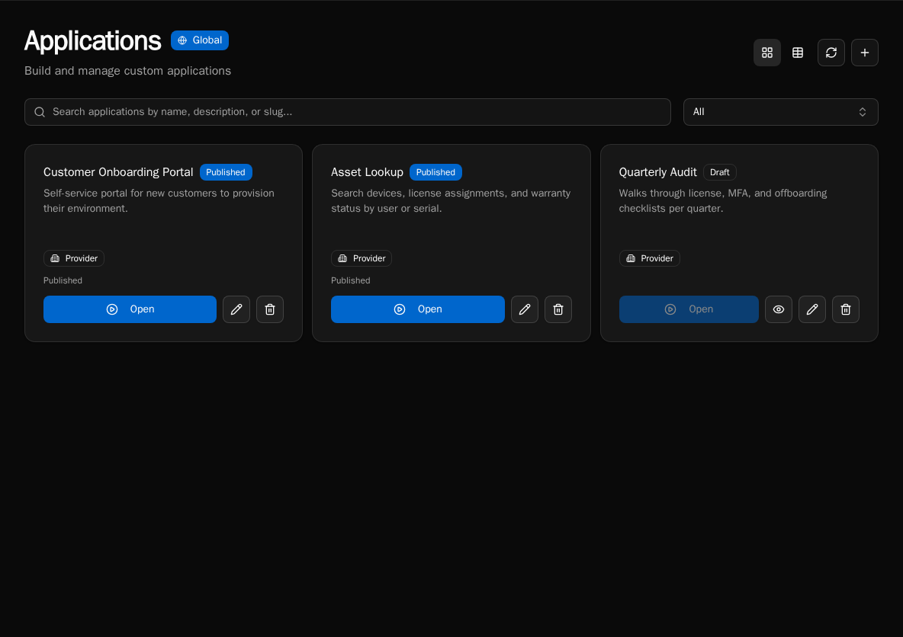

import { Aside } from '@astrojs/starlight/components';

## What is App Builder?

App Builder lets you create custom web applications using TypeScript/TSX files. Applications consist of pages, layouts, and components -- all rendered by the Bifrost runtime with full creative control over UI.



**Key capabilities:**

- TypeScript/TSX file-based development
- Pre-built UI components (shadcn/ui) plus custom components
- Custom CSS with dark mode support
- Workflow integration for backend logic via `useWorkflowQuery` and `useWorkflowMutation`
- External npm dependencies (up to 20 packages via esm.sh)
- Role-based permissions
- Automatic routing from file structure

## How It Works

```
Create app → Add layout → Add pages → Connect workflows → Publish
```

**Application lifecycle:**

1. Create application with `create_app`
2. Add `_layout.tsx` with `<Outlet />` for routing
3. Add pages in `pages/` directory
4. Connect to workflows using `useWorkflowQuery` and `useWorkflowMutation` hooks
5. Preview in draft mode
6. Publish when ready

## Critical Rules

<Aside type="danger" title="Must Follow">
1. **USE WORKFLOW IDs** - Always use UUIDs, not workflow names
2. **USE `<Outlet />`** - Layouts must use `<Outlet />`, not `{children}`
</Aside>

## File Structure

```
app.yaml              # Metadata (name, description, dependencies)
_layout.tsx           # Root layout wrapper (required)
_providers.tsx        # Optional context providers
styles.css            # Custom CSS (dark mode via .dark selector)
pages/
  index.tsx           # Home page (/)
  about.tsx           # About page (/about)
  clients/
    index.tsx         # Clients list (/clients)
    [id].tsx          # Client detail (/clients/:id)
components/
  MyComponent.tsx     # Shared components
modules/
  utils.ts            # Utility modules
```

## Imports

Everything comes from a single `"bifrost"` import:

```tsx
import { Button, Card, useState, useWorkflowQuery, cn, toast } from "bifrost";
```

External npm packages (declared in `app.yaml`) use standard imports:

```tsx
import dayjs from "dayjs";
```

## Available Modules

- **React**: `useState`, `useEffect`, `useMemo`, `useCallback`, `useRef`, `useContext`
- **Bifrost Hooks**: `useWorkflowQuery`, `useWorkflowMutation`, `useUser`, `useAppState`, `useNavigate`, `useLocation`, `useParams`, `useSearchParams`
- **Routing**: `Outlet`, `Link`
- **UI Components**: Full shadcn/ui set -- Button, Card, Table, Select, Badge, Input, Dialog, Tabs, Combobox, CalendarPicker, DateRangePicker, and more
- **Icons**: All lucide-react icons (`Settings`, `ChevronRight`, `Search`, `Plus`, etc.)
- **Utilities**: `cn` (class merging), `toast` (notifications), `format` (date-fns)

## Layout Pattern

The root `_layout.tsx` must use `<Outlet />`:

```tsx
import { Outlet } from "bifrost";

export default function RootLayout() {
  return (
    <div className="h-full bg-background overflow-hidden">
      <Outlet />
    </div>
  );
}
```

## Workflow Hooks

Connect to backend workflows using workflow UUIDs:

```tsx
import { useWorkflowQuery, useWorkflowMutation } from "bifrost";

// Auto-executes on mount -- for loading data
const { data, isLoading, refetch } = useWorkflowQuery("ef8cf1f2-...");

// Manual execution -- for user-triggered actions
const { execute, isLoading } = useWorkflowMutation("abc12345-...");
await execute({ customer_id: "123" });
```

<Aside type="caution">
Get workflow IDs from `list_workflows` MCP tool before building your app.
</Aside>

## Example Page

```tsx
// pages/index.tsx
import {
  useWorkflowQuery, Skeleton, Card, CardContent
} from "bifrost";

export default function HomePage() {
  const { data, isLoading } = useWorkflowQuery("ef8cf1f2-b451-47f4-aee8-336f7cb21d33");

  if (isLoading) {
    return <Skeleton className="h-32 w-full" />;
  }

  return (
    <div className="flex flex-col h-full p-6 overflow-hidden">
      <h1 className="text-2xl font-bold mb-4 shrink-0">Dashboard</h1>
      <Card className="flex-1 min-h-0 overflow-auto">
        <CardContent>
          {data?.items?.map(item => (
            <div key={item.id}>{item.name}</div>
          ))}
        </CardContent>
      </Card>
    </div>
  );
}
```

## Scrolling Content

Your app renders in a fixed-height container. The platform does not scroll the page for you -- if a page needs scrolling, add `overflow-auto` to the element that should scroll.

| Element | Classes | Purpose |
|---------|---------|---------|
| Page root | `flex flex-col h-full overflow-hidden` | Full height flex |
| Headers | `shrink-0` | Fixed height |
| Content | `flex-1 min-h-0 overflow-auto` | Scrollable |

## Permissions

### Application Level

Control who can access the app via the `access_level` setting:

- `authenticated` - Any logged-in user
- `role_based` - Specific roles only (set `role_ids`)

### Component Level

Hide components conditionally using the current user's roles. `useUser()` returns a `roles` array plus a `hasRole(role)` helper -- prefer `hasRole` for inline checks:

```tsx
const user = useUser();

{user.hasRole('Admin') && (
  <Button variant="destructive">Delete All</Button>
)}
```

For declarative gating around a whole subtree, use the `RequireRole` component:

```tsx
<RequireRole role="Admin">
  <Button variant="destructive">Delete All</Button>
</RequireRole>
```

See the [Code-Based Apps reference](/sdk-reference/app-builder/code-apps) for the full `useUser()` shape and `RequireRole` props.

## Managing Apps via MCP

Build apps using MCP tools:

| Tool | Description |
|------|-------------|
| `create_app` | Create app metadata |
| `get_app` | Get app info and file list |
| `list_workflows` | Get workflow IDs |
| `replace_content` | Create/update TSX files |
| `get_content` | Read file contents |
| `publish_app` | Publish to users |

**Workflow:**
1. `create_app` with name and slug
2. `list_workflows` to get IDs you need
3. `replace_content` for `_layout.tsx`
4. `replace_content` for `pages/index.tsx`
5. Preview at `/apps/{slug}`
6. `publish_app` when ready

## Next Steps

- [Code-Based Apps Reference](/sdk-reference/app-builder/code-apps) - Complete API reference
