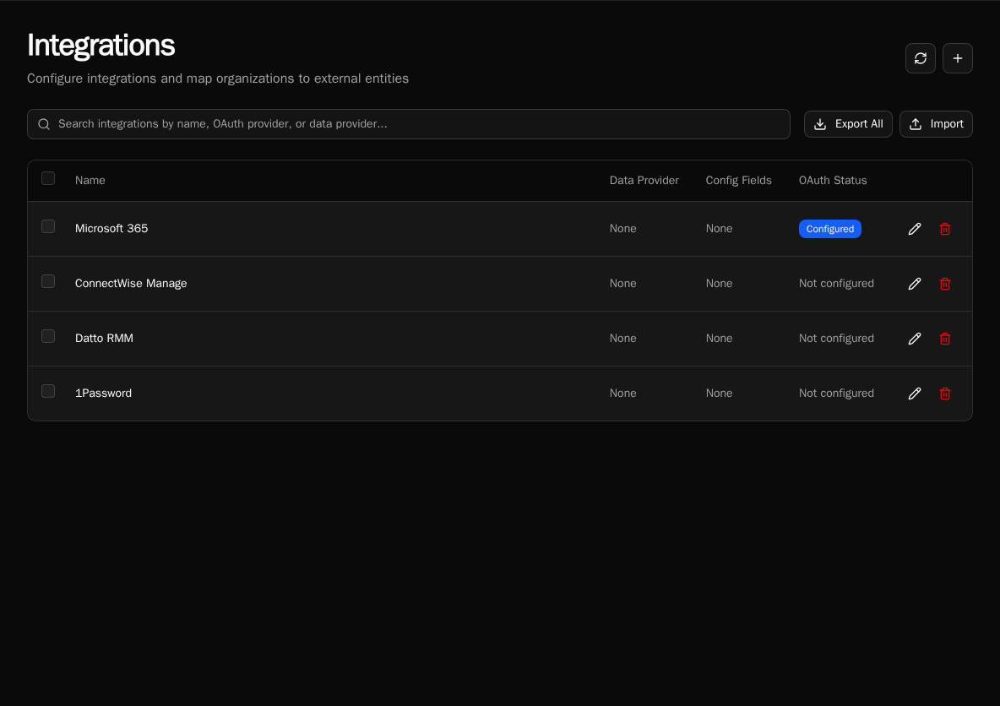

import { Aside } from '@astrojs/starlight/components';

Integrations are the bridge between Bifrost and external APIs. They combine OAuth credentials, configuration, and organization-specific settings into a unified system.

<Aside type="tip" title="Integrations vs Configs — when to use which">
**Integrations are the preferred way to manage external connections — even for non-OAuth services.** The integration entity gives you a clear "here are my external connections" surface and supports per-org overrides via `IntegrationMapping`.

**Configs are for arbitrary org-scoped or global key-value pairs that don't represent a connection** — feature flags, default labels, retry counts, anything that isn't an outgoing connection identity.

**Per-org override pattern:** link an integration to a Bifrost organization-list data provider in your form (a workflow you author with `@data_provider` that returns `[{ "label": org.name, "value": org.id }]` from `bifrost.organizations.list()`). The form's selected org becomes the workflow's org context, and `integrations.get()` then returns that org's mapping and entity_id automatically. This is the canonical way to scope an integration call to an arbitrary org from a form.
</Aside>

## What Are Integrations?

An integration represents a connection to an external service like Microsoft Graph, HaloPSA, or any REST API. Each integration can have:



Integrations provide:

- **OAuth credentials** - Access tokens managed by Bifrost
- **Configuration** - API keys, base URLs, timeouts
- **Entity mapping** - Organization-specific tenant IDs or company IDs
- **Generated SDK** - Auto-generated Python client from OpenAPI spec

## Two-Level Configuration

Integrations support configuration at two levels:

| Level | Scope | Use Case |
|-------|-------|----------|
| **Integration defaults** | All organizations | Base URLs, default settings |
| **Organization overrides** | Single organization | Tenant-specific IDs, custom endpoints |

When your workflow requests an integration, Bifrost merges defaults with org-specific overrides:

```python
from bifrost import integrations

# Get merged configuration
integration = await integrations.get("HaloPSA")
base_url = integration.config.get("base_url")  # Merged from defaults + org
tenant_id = integration.entity_id               # Org-specific
```

## OAuth Management

Integrations replace the legacy `oauth` module with better organization:

```python
# Old approach (deprecated)
# from bifrost import oauth
# conn = await oauth.get("Microsoft_Graph")

# New approach
from bifrost import integrations

integration = await integrations.get("Microsoft_Graph")
if integration and integration.oauth:
    token = integration.oauth.access_token
```

<Aside type="note">
OAuth tokens are automatically refreshed by Bifrost. You always get valid credentials.
</Aside>

## Entity Mapping

For multi-tenant APIs, integrations track external entity IDs per organization:

| Field | Description |
|-------|-------------|
| `entity_id` | The external ID (tenant_id, company_id) |
| `entity_name` | Display name for the entity |

### Why `entity_id` matters

`entity_id` is the **routing key** for org-scoped OAuth and API calls. Each `IntegrationMapping` is a `(org_id, integration_id, entity_id)` triple, and the `entity_id` becomes the connection identity downstream API calls use to address the right tenant or customer record:

- **Microsoft Graph** → `entity_id` is the Entra ID `tenant_id`
- **HaloPSA** → `entity_id` is the HaloPSA `company_id`
- **ConnectWise / Autotask** → `entity_id` is the customer/company key

A single integration can serve many Bifrost organizations because each one carries its own `entity_id` in its mapping. Without that mapping, every org would share one set of credentials and target one external tenant — defeating the per-customer scoping that MSPs need.

```
Bifrost Org
    │
    ▼
IntegrationMapping(entity_id, oauth_token)
    │
    ▼
External API call (scoped to entity_id)
```

This enables one integration to serve multiple tenants:

```python
# Each org has its own HaloPSA tenant
integration = await integrations.get("HaloPSA")
tenant_id = integration.entity_id  # "customer-123" for this org
```

## Config Schema

Integrations define a schema for configuration values:

```python
# Example schema
[
    {"key": "base_url", "type": "string", "required": True},
    {"key": "api_key", "type": "secret", "required": True},
    {"key": "timeout", "type": "int", "required": False}
]
```

Supported types:
- `string` - Text values
- `int` - Integer values
- `bool` - Boolean flags
- `json` - Complex JSON objects
- `secret` - Encrypted sensitive data

## SDK Generation

Integrations can auto-generate Python SDKs from OpenAPI specs:

1. Provide an OpenAPI spec URL
2. Select authentication method (OAuth, API key, etc.)
3. Bifrost generates a typed Python client
4. Use the client in workflows with zero-config auth

```python
# Generated SDK auto-authenticates via integration
from modules import example_api

result = await example_api.list_resources()  # Auth handled automatically
```

## Access in Workflows

```python
from bifrost import workflow, integrations
import httpx

@workflow
async def sync_data():
    # Get integration with merged config and OAuth
    integration = await integrations.get("ExternalAPI")

    if not integration:
        return {"error": "Integration not configured"}

    # Use OAuth token
    headers = {}
    if integration.oauth:
        headers["Authorization"] = f"Bearer {integration.oauth.access_token}"

    # Use config values
    base_url = integration.config.get("base_url")

    async with httpx.AsyncClient() as client:
        response = await client.get(f"{base_url}/data", headers=headers)
        return response.json()
```

## Next Steps

- [Creating Integrations](/how-to-guides/integrations/creating-integrations) - Setup guide
- [SDK Generation](/how-to-guides/integrations/sdk-generation) - Generate API clients
- [Integrations Module](/sdk-reference/sdk/integrations-module) - SDK reference
