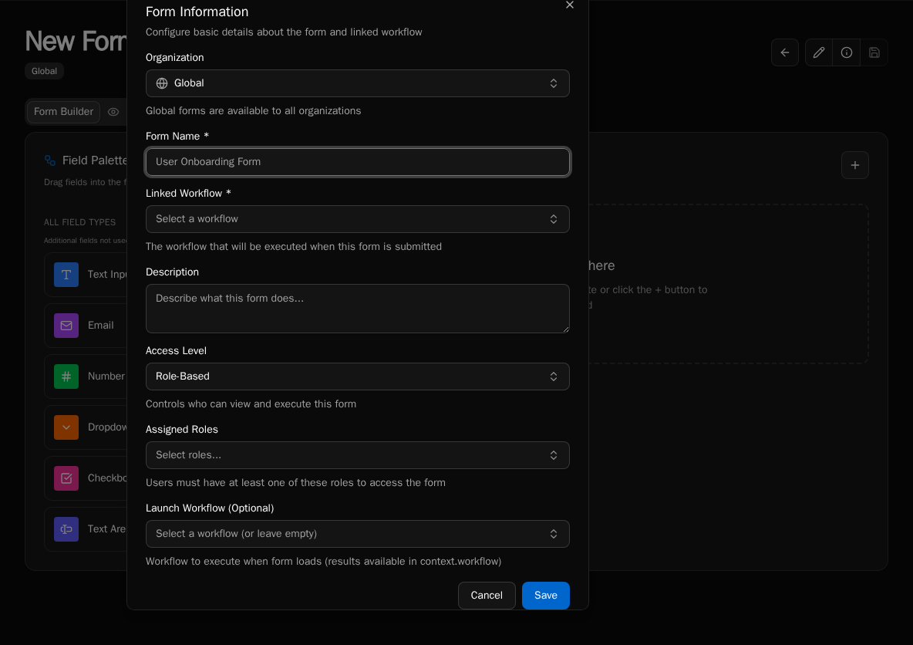
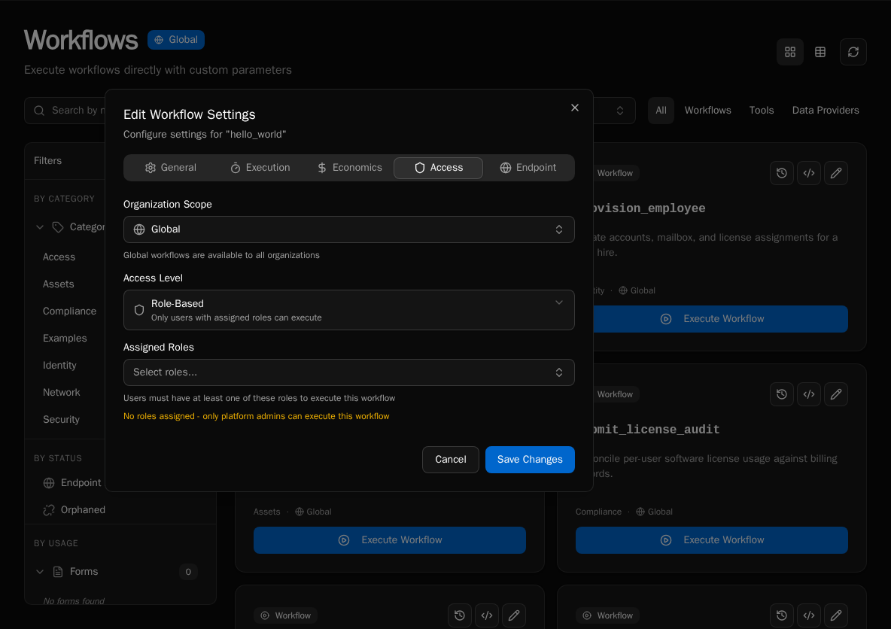
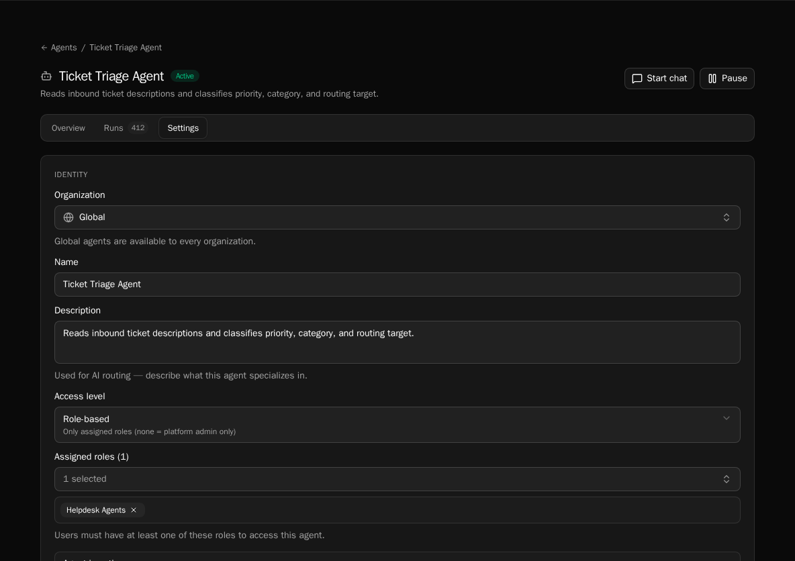
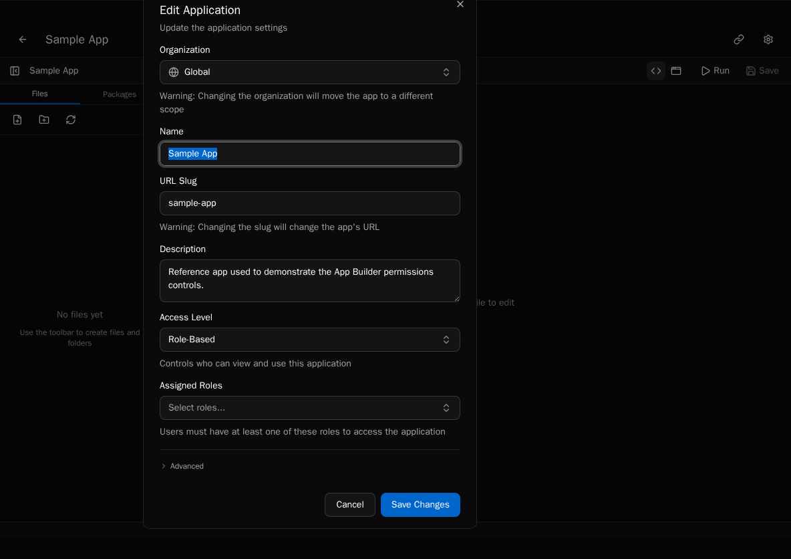

Bifrost gates every executable surface — forms, workflows, agents, and apps — with the same two-axis model: an **`access_level`** column on the entity and an optional **roles** binding. Tables, knowledge, integrations, and other admin surfaces are platform-admin-only by default and follow a separate model described at the bottom of this page.

## The model in one paragraph

Every form, workflow, agent, and app stores an `access_level` enum and a list of roles. `authenticated` means any signed-in user can access it. `role_based` means the user must hold at least one of the bound roles, or be a platform admin. Roles are simple labels created in **Settings → Roles** and assigned to users — there is no `PlatformAdmin` or `OrgUser` synthetic role; platform-admin status is a column flag on the user, not a role string.

## Forms

Forms control submission access via `FormAccessLevel`:

| `access_level` | Who can submit |
|----------------|----------------|
| `authenticated` | Any signed-in user in the org |
| `role_based` | Users whose roles intersect the form's `roles` list, plus platform admins |

`role_based` with an **empty** `roles` list collapses to "platform admin only" — useful for forms that should remain hidden until rolled out.

The picker UI lives on the form-edit screen:



Because forms are the discovery surface for end users, this is the most common place a non-admin user encounters access control. Workflow access is enforced again at execution time, so a misconfigured form cannot escalate workflow privileges.

## Workflows

Workflows store `access_level` directly on the workflow record. The default for new workflows is `authenticated`, so registering a workflow without setting permissions makes it callable by every signed-in user of the org. Use `role_based` to restrict execution to specific roles.

You can also gate sensitive logic *inside* the workflow body using the execution context:

```python
from bifrost import workflow
from bifrost._execution_context import ExecutionContext

@workflow(name="delete_user", access_level="role_based")
async def delete_user(context: ExecutionContext, user_id: str):
    if not context.is_platform_admin:
        raise PermissionError("Only platform admins can delete users")
    # ...
```

`context.is_platform_admin` is a boolean on every execution context. `access_level` enforcement happens at the launch boundary; the in-body check is for second-line defense or for branching behavior on caller identity.



## Agents

Agents add a third value to the enum: `private`. The full set is:

| `access_level` | Behavior |
|----------------|----------|
| `authenticated` | Any signed-in user can chat with the agent |
| `role_based` | Visibility limited to users whose roles intersect the agent's `roles` |
| `private` | Hidden from user-facing surfaces; only callable by other agents (delegation) or by autonomous schedules |

When the platform resolves a chat request, agents whose access does not match are filtered out of the picker entirely — they're invisible, not greyed out. Tools an agent can call are governed separately by the underlying workflow's `access_level`.



## Apps

App access maps to the same enum forms use (`authenticated` or `role_based`) plus a `roles` list. App permissions gate **rendering** — a user without access to an app does not see it in the launcher or load its bundle.

Inside an app, use the platform `useUser()` hook or the `<RequireRole>` component to branch on role membership:

```tsx
import { useUser, RequireRole, Button } from "bifrost";

export default function ExpensesApp() {
    const user = useUser();

    return (
        <div>
            <h1>Welcome, {user.name}</h1>

            <RequireRole role="Finance">
                <Button onClick={() => approveAll()}>Approve all pending</Button>
            </RequireRole>

            {user.hasRole("Admin") && <SettingsLink />}
        </div>
    );
}
```

`user.roles` is a `string[]` of role names. `user.hasRole(name)` returns a boolean. `<RequireRole>` renders its children only when the user holds the named role and accepts an optional `fallback` prop.

Backend access is unaffected: an app calling a workflow still goes through the workflow's `access_level` check.



## Tables, Knowledge, Integrations

These surfaces do not carry a per-entity `access_level`. They are managed in **Settings** by platform admins, and the SDK exposes them read/write to any workflow or app the calling user can already reach. Per-org isolation is enforced through scope (see [Scopes](/core-concepts/scopes/)), not through role bindings.

If you need per-role data partitioning inside a table, model it in the workflow logic that reads the table — there is no row-level RBAC at the platform layer.

## Best practices

- **Start with `authenticated`.** Add `role_based` only when an action is genuinely sensitive (deleting data, approving spend, viewing PII).
- **Use named roles from your org chart**, not numbered or generic names. `Finance Approver` is searchable; `Group A` is not.
- **Keep the role count small.** 3-5 roles works for most orgs. Adding a role per workflow becomes unmaintainable.
- **Don't rely on UI hiding alone.** If a workflow truly must not run, set `access_level=role_based` on the workflow itself — gating the form is necessary but not sufficient.
- **Platform admins bypass `role_based` everywhere.** That's intentional: admins must be able to debug. Use `private` on agents or in-body `is_platform_admin` checks if you need to surface that someone is acting as admin.
