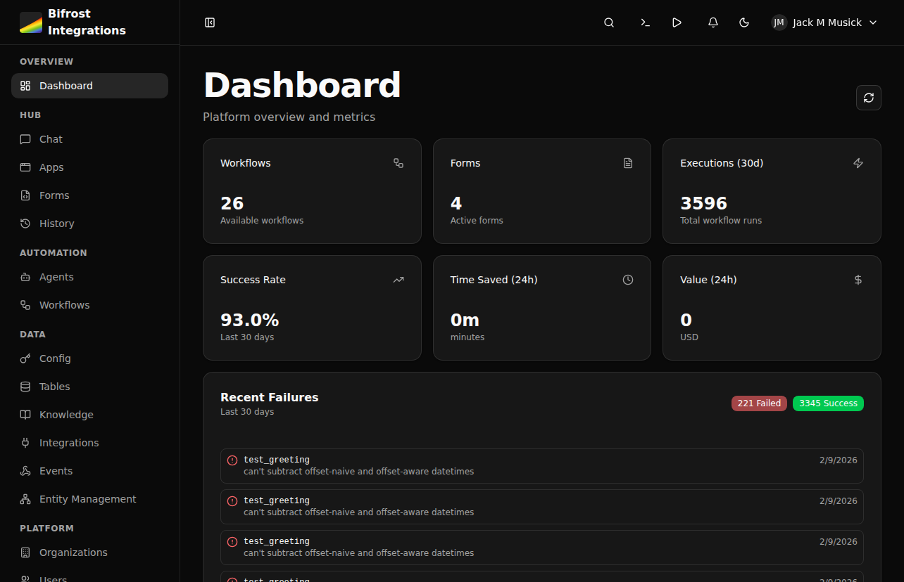

import { Card, CardGrid, Aside } from "@astrojs/starlight/components";

Bifrost Integrations is an open-source automation platform designed to democratize best-in-class tooling for the emerging Integration Services industry - before venture capital gets the chance to own something we're all incredibly passionate about: solving problems with automation.

## What Bifrost Solves

Existing RPA platforms are great for rapid development and provide helpful abstractions for things like OAuth, but **they cannot and will not keep pace with AI-powered development** and have always been constrained by limitations that traditional programming languages do not have.

Bifrost Integrations removes those limitations by creating a light management layer with the features that make RPA's uniquely valuable and letting Python do what it's good at. It's architected with multi-tenancy at its core, enabling you to scale your Integration Services business without duplicating work across customers. **This is not another RPA tool trying to be everything to everyone**; it's a platform designed specifically to help you build scalable automation businesses the right way, without vendor lock-in, and without the limitations of RPA.

<Aside type="tip">
    Want to understand the "why" behind Bifrost? Check out [Why This
    Matters](/about/why-open-source) to learn about our mission.
</Aside>

## Dashboard

The Bifrost Dashboard provides a high-level overview of your platform, including workflow counts, form statistics, execution metrics, and recent failures.



## What You Can Do with Bifrost

<CardGrid>
  <Card title="Develop with Your Favorite Tools" icon="seti:code">
    - Use VS Code, Claude Code, and Git for version control
    - Build with Python and modern development workflows
    - Test locally before deploying to production
  </Card>

{" "}
<Card title="Build Reusable Integrations" icon="puzzle">
    - Create integration modules for common platforms (NinjaOne, HaloPSA, Pax8,
    Microsoft CSP) - Abstract authentication, pagination, and API complexity -
    Share functionality across all your workflows
</Card>

{" "}
<Card title="Centralized Connection Management" icon="setting">
    - Automated OAuth refresh flows - Key/value configuration storage per
    organization - Encrypted secrets storage
</Card>

{" "}
<Card title="Dynamic Forms and Workflows" icon="document">
    - Create flexible forms for you and your customers - Build context-aware
    workflows that adapt based on organization and user - Generate form inputs
    programmatically from data providers
</Card>

{" "}
<Card title="Multi-Tenant Architecture" icon="users">
    - Scope functionality globally or to specific organizations - Deliver value
    to customers without code duplication or redeployment - Complete data
    isolation between tenants
</Card>

  <Card title="AI-Assisted Development" icon="star">
    - Built for modern AI coding workflows
    - Use Claude Code, GitHub Copilot, and other AI tools
    - Write workflows from natural language descriptions
  </Card>
</CardGrid>

## Core Architecture

```
┌─────────────────────────────────────────┐
│  Client (React)                          │
│  Forms | Workflows | Admin               │
└────────────────┬────────────────────────┘
                 │ REST API / WebSocket
                 ▼
┌─────────────────────────────────────────┐
│  API (FastAPI)                           │
│  HTTP Handlers | Auth | Workflow Engine  │
└────────────────┬────────────────────────┘
                 │
    ┌────────────┼────────────┐
    ▼            ▼            ▼
┌────────┐  ┌────────┐  ┌────────┐
│Worker  │  │Scheduler│  │ MinIO  │
│(async) │  │(cron)  │  │  (S3)  │
└────────┘  └────────┘  └────────┘
    │            │            │
    └────────────┼────────────┘
                 ▼
┌─────────────────────────────────────────┐
│  PostgreSQL | RabbitMQ | Redis          │
└─────────────────────────────────────────┘
```

| Component      | Purpose                                                           |
| -------------- | ----------------------------------------------------------------- |
| **API**        | HTTP endpoints, authentication, workflow execution                |
| **Worker**     | Background job processing (scalable, downloads workspace from S3) |
| **Scheduler**  | Runs scheduled workflows and cleanup jobs                         |
| **MinIO/S3**   | Object storage for workspace files                                |
| **PostgreSQL** | Primary database for all data                                     |
| **RabbitMQ**   | Message queue for async job dispatch                              |
| **Redis**      | Sessions, cache, sync execution results                           |

## Core Concepts

### Workflows

Python async functions decorated with `@workflow`:

```python
@workflow
async def create_user(email: str, name: str):
    """Create a new user in the system."""
    return {"user_id": "123"}
```

The decorator auto-infers name, description, and parameters from your function. After writing your code, you register the function to make it available in the UI, forms, scheduled jobs, and webhooks.

### Forms

UI for workflows with:

-   Multiple field types
-   Data provider integration for dynamic lists
-   Visibility rules
-   Real-time validation

### Data Providers

Dynamic options for dropdowns:

```python
from bifrost import data_provider, context

@data_provider(name="get_departments")
async def get_departments():
    org_id = context.org_id  # Access via proxy if needed
    return [
        {"label": "Engineering", "value": "eng"},
        {"label": "Sales", "value": "sales"}
    ]
```

### Workflow Registration

Workflows are registered explicitly after you write the code:

1. Developer creates a Python file with `@workflow` or `@data_provider` decorators
2. Developer registers the function via Code Editor, API, or MCP
3. Platform indexes metadata (name, description, parameters) in the database
4. Workflow is exposed via REST API and appears in the UI

When you edit files in the UI editor, changes are pushed to workers via RabbitMQ, keeping all instances in sync. This enables you to organize your code by feature, customer, or whatever you find most useful.

## Multi-Tenancy

-   **Organization Isolation**: Context provides information about who the caller is so you can make decisions in your code
-   **Org-Scoped Secrets**: Stored as configurations, configs and secrets will default to the caller's organization first and call back to global secrets with the same name.
-   **Forms**: Forms expose workflows in a user-friendly way and can be scoped to an organization. Form configuration is designed in the UI and stored in the database.

## Security

-   **Authentication**: Local auth, Microsoft, Google, or any OIDC provider
-   **Authorization**: Role-based access control (RBAC) to forms
-   **Secret Management**: Encrypted secrets stored in PostgreSQL
-   **Audit Logging**: Most actions logged with user context
-   **OAuth Flow**: Secure OAuth 2.0 token management with automatic refresh

## Use Cases

### MSP/IT Service Providers

-   User onboarding/offboarding
-   License management
-   Ticket automation
-   Service request forms
-   Compliance reporting

### Enterprise IT

-   Multi-system user provisioning
-   Self-service capabilities
-   Bulk operations via forms
-   Line-of-business app integration

### Integration Services

-   Data synchronization
-   Event-driven workflows
-   API orchestration
-   Custom business logic

## Open Source

-   **License**: AGPL
-   **Repository**: [github.com/jackmusick/bifrost-api](https://github.com/jackmusick/bifrost-api)

## Next Steps

-   [Installation Guide](/getting-started/installation) - Deploy with Docker Compose
-   [First Workflow Tutorial](/getting-started/first-workflow) - Build your first workflow
-   [Create Forms](/getting-started/creating-forms) - Build dynamic forms
-   [OAuth Integration](/getting-started/integrations) - Connect external APIs
