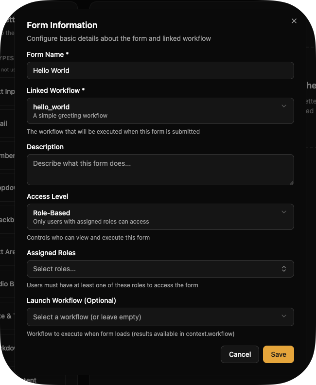
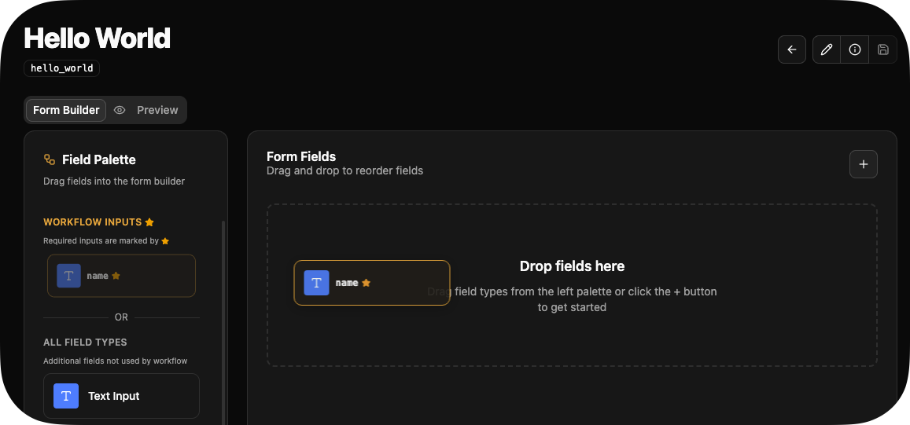
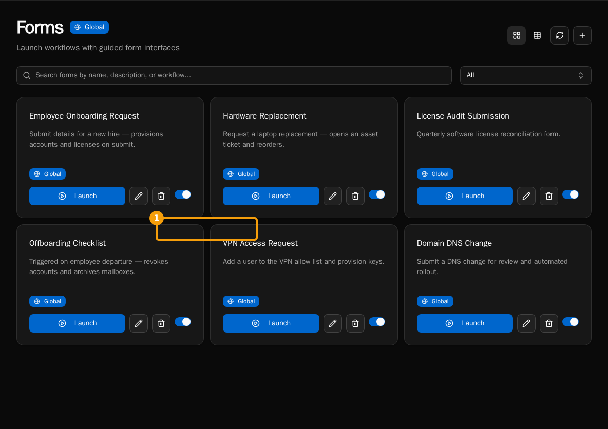

import { Steps } from "@astrojs/starlight/components";

Forms are a way to dynamically configure input for workflows and expose them in a user-friendly way. Think about it this way: You have a script called `offboard_user`. It might need to accept a `user_id` to determine which Microsoft 365 user to offboard. With forms, you can expose the actual list of users to select from instead of typing in a `user_id`.

## What You'll Build

A form that collects user information and executes a workflow to create the user.

## Prerequisites

-   [Installation complete](/getting-started/installation)
-   At least one workflow created (try [First Workflow](/getting-started/first-workflow) first)

## Create the Form

<Steps>

1. Navigate to **Forms** → Click **+** button

2. Fill in form details:

    - **Name**: "Hello World"
    - **Description**: "Hello from Bifrost"
    - **Linked Workflow**: Select your workflow (e.g., `hello_world`)

    

3. Click **Create**

</Steps>

## Add Fields

<Steps>

1. **From Workflow Parameters**:

    - Drag workflow parameters from left panel
    - Fields marked with a star are ones required by the workflow
    - Fields are auto-configure with correct types

    

2. **Or use Field Types**:

    - Drag field type (Text, Email, Select, etc.)
    - Configure manually

3. Arrange fields by dragging

</Steps>

## Configure Field Settings

After you drag a field, the Edit Field screen will appear. This is also available from the form.

### Basic Settings

-   **Field Name**: Variable name for the field available to workflows
-   **Label**: Display text
-   **Placeholder**: Hint text in empty field
-   **Help Text**: Additional guidance
-   **Required**: Enforce field completion
-   **Default Value**: Pre-populated value

You can find more comprehensive documentation in the How-To section under Forms.

## Test the Form

<Steps>

1. Click **Save** in form builder

2. Refresh the Forms list.

3. On your form, click **Launch**.

    

4. Fill out fields and click **Submit**

</Steps>

You'll see the same execution details page you did when running the workflow directly.

## Visibility Rules

Show/hide fields conditionally:

```javascript
// Show "Manager Email" only if "Is Manager" is checked
context.field.is_manager === true;

// Show "Department" only if "Employee Type" is "full-time"
context.field.employee_type === "full-time";
```

## Use Data Providers

Create dynamic dropdowns with data providers:

1. Create `workspace/data_providers/departments.py`:

```python
from bifrost import data_provider

@data_provider(
    name="get_departments",
    description="List of departments"
)
async def get_departments():
    return [
        {"label": "Engineering", "value": "eng"},
        {"label": "Sales", "value": "sales"},
        {"label": "Support", "value": "support"}
    ]
```

2. In form builder, select field → **Data Provider** → `get_departments`

3. Save and test - dropdown auto-populates

## Next Steps

-   [Data Providers Guide](/how-to-guides/forms/data-providers) - Advanced provider patterns
-   [Visibility Rules](/how-to-guides/forms/visibility-rules) - Complex conditional logic
-   [HTML Content](/how-to-guides/forms/html-content) - Add rich text and formatting
