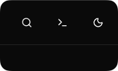
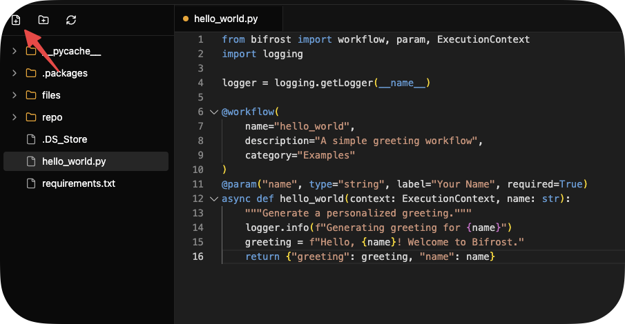
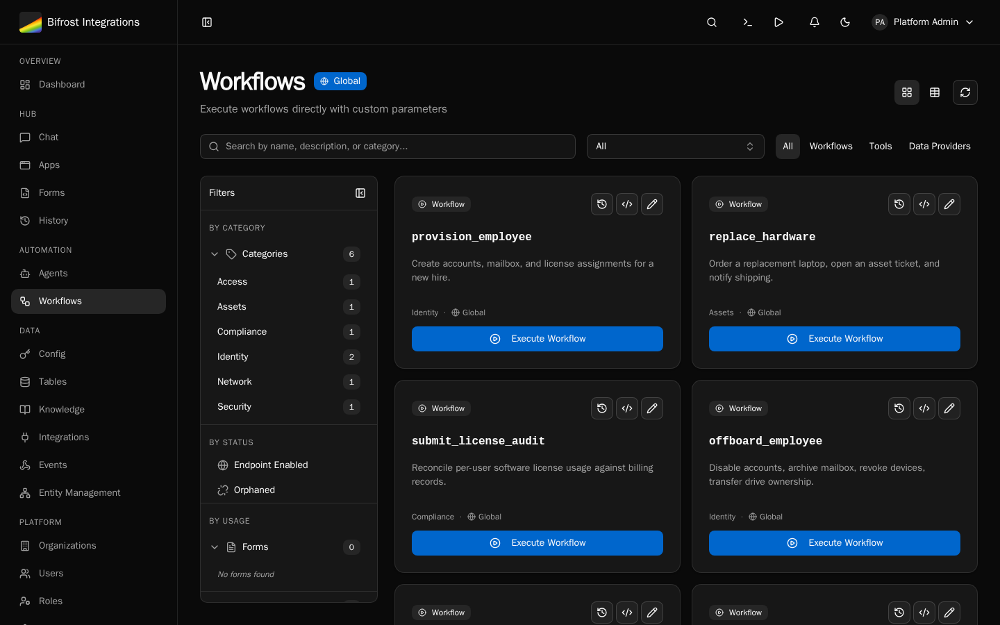
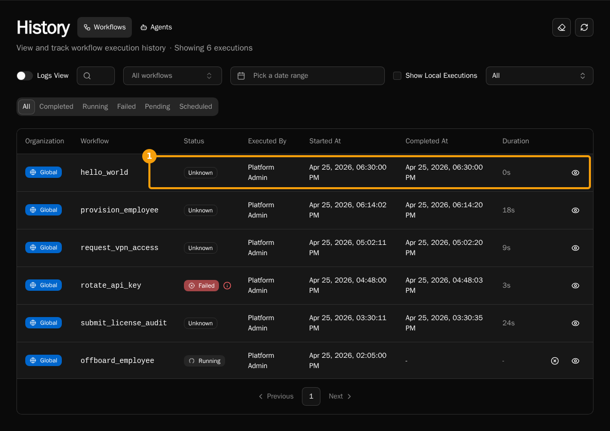

import { Steps } from "@astrojs/starlight/components";

Learn by building a simple greeting workflow with parameters and validation.

## What You'll Build

A workflow that accepts a name and returns a personalized greeting.

## Prerequisites

-   [Installation complete](/getting-started/installation)
-   Text editor (VS Code recommended)

## Create the Workflow

<Steps>

1. Open the Code Editor from the header.

    

1. Create a new file called `hello_world.py`:

    

    ```python
    from bifrost import workflow
    import logging

    logger = logging.getLogger(__name__)

    @workflow(category="Examples")
    async def hello_world(name: str):
        """A simple greeting workflow."""
        logger.info(f"Generating greeting for {name}")
        greeting = f"Hello, {name}! Welcome to Bifrost."
        return {"greeting": greeting, "name": name}
    ```

    Note how the decorator infers:
    - **name**: `"hello_world"` from the function name
    - **description**: `"A simple greeting workflow."` from the docstring
    - **parameters**: `name` (required string) from the function signature

1. Hit `CTRL/CMD + S` to save.
1. Click **Register** above the `hello_world` function to register it with the platform.
1. Navigate to **Workflows** → **Examples** → **Hello World**

    

1. Click **Execute**, enter your name, and click **Run**

</Steps>

## Expected Result



```json
{
    "greeting": "Hello, Alice! Welcome to Bifrost.",
    "name": "Alice"
}
```

## View Execution Logs

Navigate to **Executions** to see all runs with logs and results.

## Next Steps

-   [Writing Workflows Guide](/how-to-guides/workflows/writing-workflows) - Full workflow reference
-   [Using Decorators](/how-to-guides/workflows/using-decorators) - Advanced decorator features
-   [Create Dynamic Forms](/getting-started/creating-forms) - Build UI for your workflows
