import { Steps, Aside } from "@astrojs/starlight/components";

## Prerequisites

Before deploying to Azure, you need an active Azure Subscription.

<Aside type="tip">
    Microsoft Partner? You probably have credits available in your partner center. Click <a href="https://learn.microsoft.com/en-us/partner-center/benefits/mpn-benefits-azure-cloud" target="_blank">here</a> to learn more.
</Aside>

### Required Permissions

Your Azure account needs these permissions:

-   Create resource groups
-   Create storage accounts
-   Create function apps
-   Create key vaults
-   Create application insights
-   Create static web apps

## Overview

The ARM template creates the following Azure resources:

-   **Azure Functions (Flex Consumption Plan)** - Serverless backend runtime
-   **Storage Account (Standard_LRS)** - Tables and file storage
-   **Azure Key Vault** - Secure secrets management
-   **Application Insights** - Performance monitoring and diagnostics
-   **Static Web App** - React frontend hosting

## Infrastructure Setup

### Entra App Registration

<Steps>

1. Login to [Entra](https://entra.microsoft.com).

2. Navigate to App Registrations.

3. Click **New Registration**.

    - For the name, put whatever you want like `Bifrost Integrations` or `MyMSP Automation`.
    - For the account types, select Multitenant unless you do _NOT_ have customers or partners that need to login and run forms.
    - For the Redirect URI, select **Web** as the platform and type in the URL you intend to use for the application. This can be changed later. Example:

        `https://bifrost.mydomain.com/.auth/login/aad/callback`

        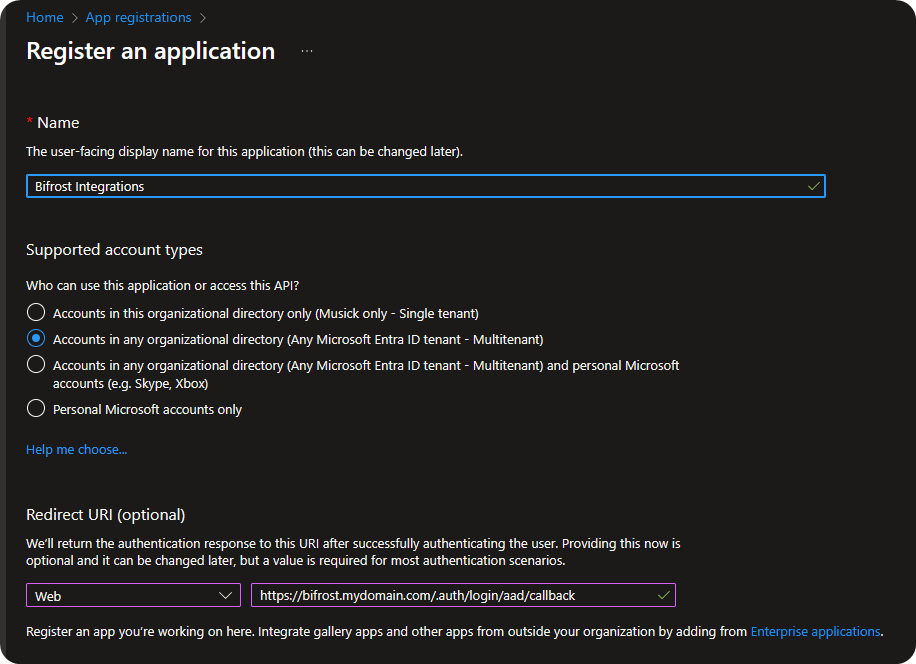

4. Under **Overview**, copy your Application ID. You'll need this later.

5. Under **Certificates & Secrets**, create a new client secret and copy this to your password manager along with the Client ID. You'll need this later.

6. Under **Authentication**, enable ID tokens.

    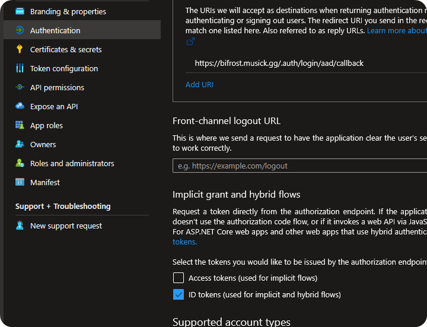

7. Under API Permissions, grant admin consent.

    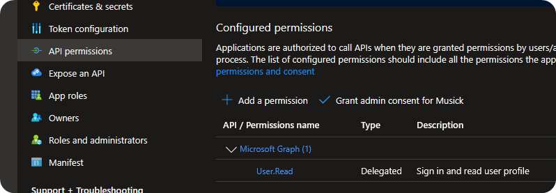

</Steps>

### Azure Subscription

<Steps>

1. Open up the Cloud Terminal.

2. Enter this command:

    ```bash
    az provider register --namespace Microsoft.OperationalInsights
    ```

    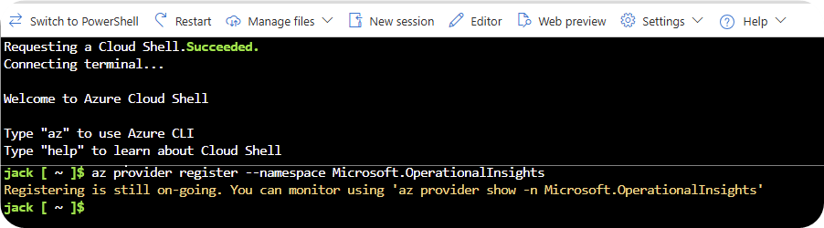

</Steps>

## Deployment

Because we're using Azure Functions Flex Consumption plans, there's only one way to deploy the application.

<Steps>

1. Fork the [API](https://github.com/jackmusick/bifrost-api) and [Client](https://github.com/jackmusick/bifrost-client) repository.

    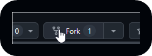

2. Create your [GitHub Personal Access Token](https://learn.microsoft.com/en-us/azure/static-web-apps/publish-azure-resource-manager?tabs=azure-cli#create-a-github-personal-access-token) and save it to your password manager.

    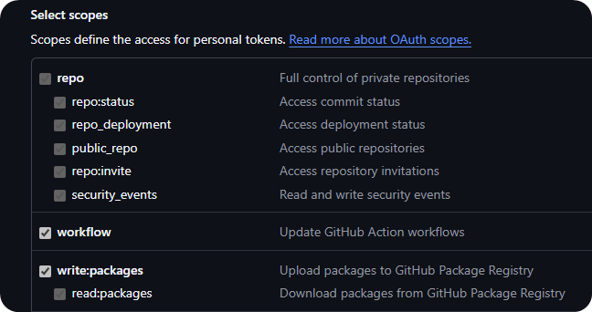

3. Use the below Deploy to Azure button to automatically setup all of your resources. Azure will ask you for the Entra ID Client ID and Secret you created above.

    <Aside type="caution">
        Set a reminder to renew your Client Secret and update it on the Static
        Web App's configuration page.
    </Aside>

    <br />

    <a
        href="https://portal.azure.com/#create/Microsoft.Template/uri/https%3A%2F%2Fraw.githubusercontent.com%2Fjackmusick%2Fbifrost-api%2Frefs%2Fheads%2Fmain%2Fdeployment%2Fazuredeploy.json"
        target="_blank"
    >
        
    </a>

    <br />

4. Go to Azure Function App in Azure. On the **Overview** page, click **Get Publish Profile**.

    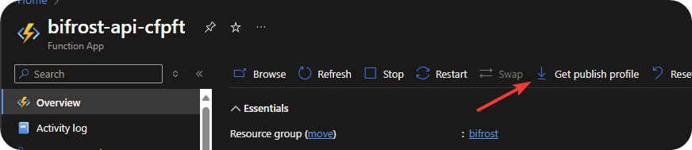

    Copy the contents of the downloaded XML content to your clipboard.

5. Go to your Bifrost API repository in GitHub → Settings → Secrets and variables → Actions.

6. Click **New repository secret**.

    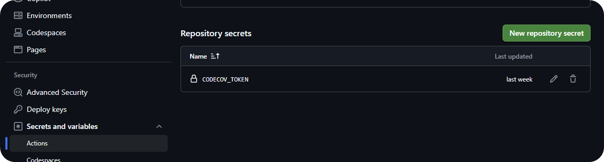

7. Add these secrets:

    | Name                                | Value               | Description                        |
    | ----------------------------------- | ------------------- | ---------------------------------- |
    | `AZURE_FUNCTIONAPP_NAME`            | `bifrost-api-xxxxx` | Your Function App name             |
    | `AZURE_FUNCTIONAPP_PUBLISH_PROFILE` | XML from step 1     | Publish profile for authentication |

8. Once added, you can go to **Actions**. You can either rerun the failed workflow in there, or open up the Azure Deploy one and manually run it.

    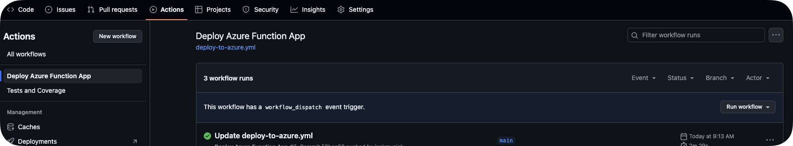

9. Once complete, you should see a list of functions in your Azure Function.

    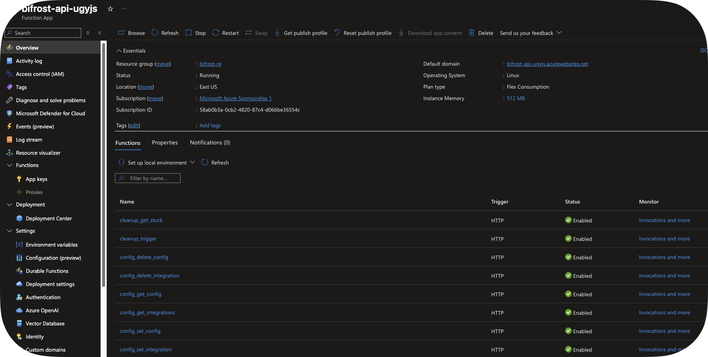

10. Add a custom domain to your Static Web App. This should match the domain you selected for your App Registration. If it doesn't, you'll need to update it on the App Registration before you login.

    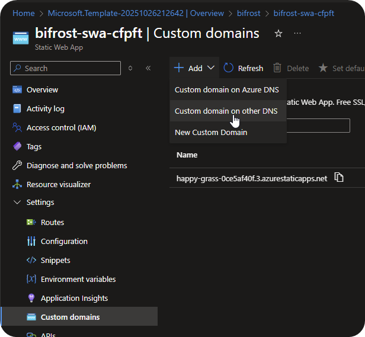

</Steps>

11. Login to your application. As the first user, you will be a Platform Admin. Future users will only be able to login if you have added them as a Platform Admin manually or their domain matches an organization's domain.
