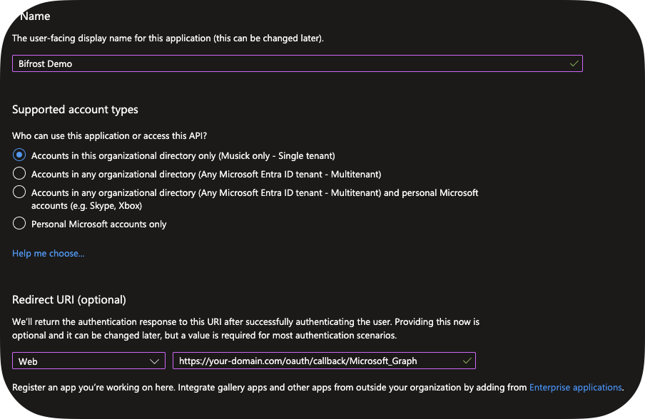
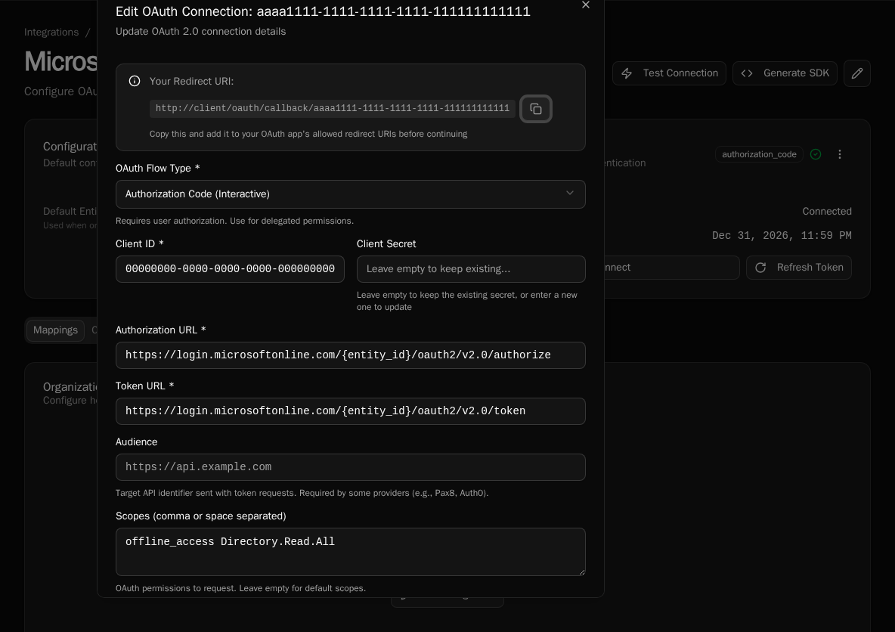
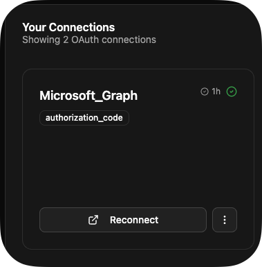

import { Steps, Aside } from "@astrojs/starlight/components";

Set up a Microsoft Graph integration with OAuth to access user data. This example shows the full pattern for any OAuth-based API.

## What You'll Build

An integration with Microsoft Graph that reads user information using OAuth.

## Prerequisites

-   [Installation complete](/getting-started/installation)
-   Administrator permissions to Entra ID

## Create Entra ID App Registration

<Steps>

1. Go to [Entra ID](https://entra.microsoft.com) → **App registrations**

1. Click **+ New registration**:

    - **Name**: "Bifrost Demo"
    - **Supported account type**: Single Tenant
    - **Redirect URI**: `https://your-domain.com/oauth/callback/Microsoft_Graph`

    Please note that you'll change the Redirect URI later as Bifrost will get you the real redirect URL.

    

1. Copy **Application (client) ID** and **Tenant ID**

    

1. Click **Endpoints** and copy your `OAuth 2.0 authorization endpoint (v2)` and `OAuth 2.0 token endpoint (v2)`.

    

1. Go to **Certificates & secrets** → **+ New client secret**:

    - Set expiration to 6 months
    - Copy secret value immediately

    

1. Go to **API permissions**:
    - Click **+ Add permission** → **Microsoft Graph** → **Delegated**
    - Add `Directory.Read.All`
    - Click **Grant admin consent**

</Steps>

<Aside type="caution">
    Save your Client ID, Client Secret, and Tenant ID - you'll need them next.
</Aside>

## Create Integration in Bifrost

<Steps>

1. Navigate to **Settings** → **Integrations**

1. Click **Create Integration**

1. Fill in details:

    - **Organization**: Global, or scoped to a specific organization
    - **Name**: Microsoft_Graph
    - **Description**: Microsoft Graph API connection

    You can skip Entity Data Provider for now. For Default Entity ID, you can use `common`.

1. Configure OAuth:

    - **OAuth Flow Type**: Authorization Code (Interactive)
    - **Client ID**: The Client ID you copied earlier
    - **Client Secret**: The Client Secret you copied earlier
    - **Authorization URL**: The OAuth 2.0 authorization endpoint (v2)

        Our token and authorization URL incldue `{entity_id}` to demonstrate the templating engine. This will be replaced with `common`, but you can also just use `common` directly here and not specify a Default Entity ID.

    - **Token URL**: The OAuth 2.0 token endpoint (v2)
    - **Scope**: offline_access Directory.Read.All

    <Aside type="tip">
        `offline_access` requests a refresh token for continuous access without
        re-authentication.
    </Aside>

    

1. Click **Save**
1. Copy the Redirect URI at the top and update your App Registration.

</Steps>

## Authorize the Connection

<Steps>

1. Click **Connect** on your integration

1. Sign in with Microsoft and consent to permissions

1. You'll be redirected back to Bifrost

1. Connection status changes to **Active**

    

</Steps>

## Use Integration in Workflow

<Steps>

1. In the Code Editor, create a new workflow called `list_users.py`

    ```python
    from bifrost import workflow, integrations
    import httpx
    import logging

    logger = logging.getLogger(__name__)

    @workflow(
        name="list_users",
        description="List users from Microsoft Graph"
    )
    async def list_users():
        """Fetch user information from Microsoft Graph."""

        # Get integration with OAuth credentials
        integration = await integrations.get("Microsoft_Graph")
        if not integration or not integration.oauth:
            return {"error": "Microsoft Graph not configured"}

        logger.info("Retrieved Microsoft Graph integration")

        async with httpx.AsyncClient() as client:
            response = await client.get(
                "https://graph.microsoft.com/v1.0/users",
                headers={"Authorization": f"Bearer {integration.oauth.access_token}"}
            )
            response.raise_for_status()
            users = response.json()["value"]

        return users
    ```

2. Use `CTRL/CMD + S` to save.

3. On the Workflows screen, click **Execute Workflow** on your `list_users` workflow.

</Steps>

## Token Refresh

Bifrost automatically refreshes expired tokens when your connection has a refresh token. If refresh fails (e.g., password changed), you'll see the error on the Integrations screen.

## Multiple Organizations

Integrations support per-organization OAuth tokens:

-   Each org can have its own Microsoft Graph connection
-   Workflows automatically use the executing org's credentials
-   Falls back to integration-level defaults if no org-specific token

```python
# Automatically uses the right token for the current org
integration = await integrations.get("Microsoft_Graph")
token = integration.oauth.access_token
```

You can also specify the organization:

```python
# Access a specific organization's integration
integration = await integrations.get("Microsoft_Graph", org_id="org-123")

# Access platform-level integration defaults (no org mapping)
integration = await integrations.get("Microsoft_Graph", scope=None)
```

## Next Steps

-   [Creating Integrations](/how-to-guides/integrations/creating-integrations) - Full integration setup
-   [SDK Generation](/how-to-guides/integrations/sdk-generation) - Generate API clients
-   [Secrets Management](/how-to-guides/integrations/secrets-management) - Secure credential storage
