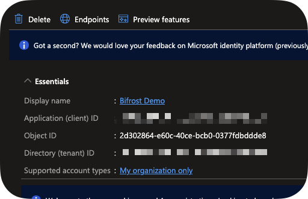
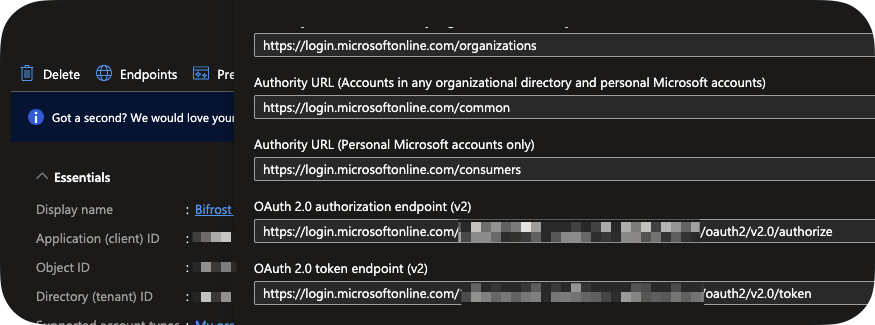
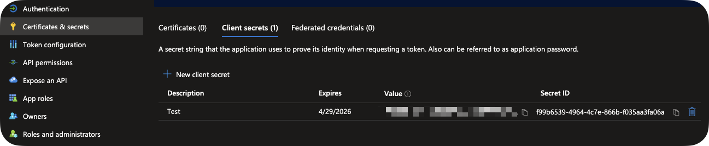
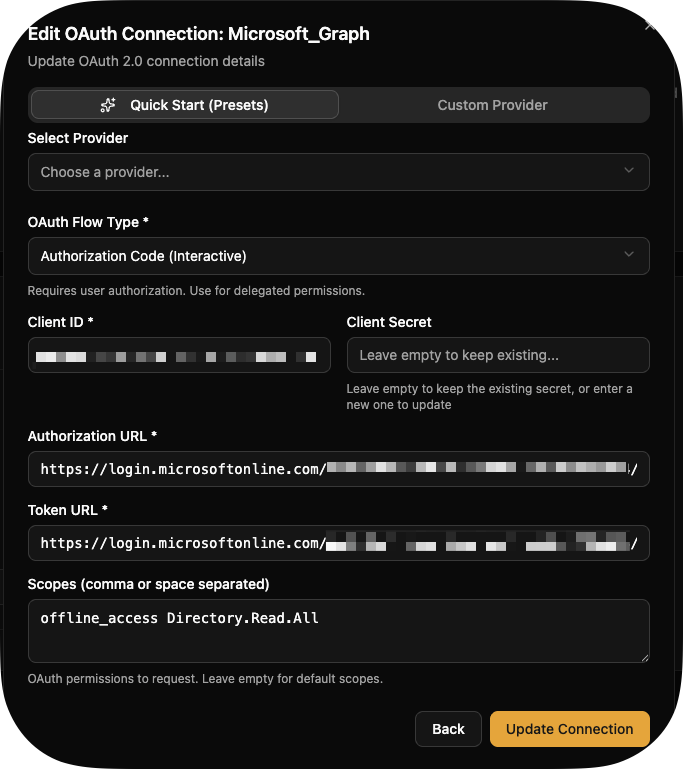

import { Steps, Aside } from "@astrojs/starlight/components";

Instead of including a bunch of integrations, we give you the tools to build them by simplifying the difficult parts of building sustainable automation, including OAuth. In this section, you'll setup a Microsoft Graph application as an OAuth provider and see how to use it in your automation.

## What You'll Build

An OAuth connection to Microsoft Graph for reading user information.

## Prerequisites

-   [Installation complete](/getting-started/installation)
-   Administrator permissions to Entra ID
-   Administrator permissions in Bifrost

## Create Azure AD App Registration

<Steps>

1. Go to [Entra ID](https://entra.microsoft.com) → **App registrations**

1. Click **+ New registration**:

    - **Name**: "Bifrost Demo"
    - **Supported account type**: Single Tenant
    - **Redirect URI**: `https://your-domain.com/oauth/callback/Microsoft_Graph`

    

1. Copy **Application (client) ID** and **Tenant ID**

    

1. Click **Endpoints** and copy your `OAuth 2.0 authorization endpoint (v2)` and `OAuth 2.0 token endpoint (v2)`.

    

1. Go to **Certificates & secrets** → **+ New client secret**:

    - Set expiration to 6 months
    - Copy secret value immediately

    

1. Go to **API permissions**:
    - Click **+ Add permission** → **Microsoft Graph** → **Delegated**
    - Add `Directory.Read.All`
    - Click **Grant admin consent**

</Steps>

<Aside type="caution">
    Save your Client ID, Client Secret, and Tenant ID - you'll need them next.
</Aside>

## Create OAuth Connection in Bifrost

<Steps>

1. Navigate to **Settings** → **Integrations** → **OAuth Connections**

1. Click **+ Add Connection**

1. Fill in details:

    - **Connection Name**: Microsoft_Graph
    - **Description**: My Microsoft Graph connection

1. Click **Create**

1. On `Custom Provider`, fill in the following:

    - **OAuth Flow Type**: Authorization Code (Interactive)
    - **Client ID**: The Client ID you copied earlier
    - **Client Secret**: The Client Secret you copied earlier
    - **Authorization URL**: The OAuth 2.0 authorization endpoint (v2) you copied earlier
    - **Token URL**: The OAuth 2.0 token endpoint (v2) you copied earlier
    - **Scope**: offline_access Directory.Read.All

        {" "}

        {" "}

        {" "}

        {" "}

        {" "}

        {" "}

        {" "}

        {" "}

        {" "}

        {" "}

        {" "}

        {" "}

        {" "}

        {" "}

        {" "}

        {" "}

        {" "}

        {" "}

        {" "}

        {" "}
        <Aside type="tip">
            `offline_access` is usually what tells a provider you want a
            `refresh_token`, which allows you to maintain continuous access to a
            service until that access is revoked. You normally want this when
            setting up an OAuth connection in a platform like Bifrost.
        </Aside>

    

</Steps>

## Authorize the Connection

<Steps>

1. Click **Connect** on your application

1. Sign in with Microsoft and consent to permissions

1. You'll be redirected back to Bifrost

1. Connection status changes to **Active**

    

</Steps>

## Use OAuth in Workflow

<Steps>

1. In the Code Editor, create a new workflow called `list_users.py`

    ```python
    from bifrost import workflow, param, oauth, ExecutionContext
    import requests
    import logging
    import json

    logger = logging.getLogger(__name__)

    @workflow(
        name="list_users",
        description="List users from Microsoft Graph"
    )
    async def list_users(context: ExecutionContext):
        """Fetch user information from Microsoft Graph."""

        # Get OAuth connection
        oauth_response = await oauth.get("Microsoft_Graph")

        logger.info("Retrieved oauth response")
        url = "https://graph.microsoft.com/v1.0/users"
        headers = {
            "Authorization": f"Bearer {oauth_response['access_token']}"
        }

        response = requests.get(url, headers=headers)
        response.raise_for_status()
        users = response.json()['value']

        return users
    ```

2. Use `CTRL/CMD + S` to save.

3. On the Workflows screen, click **Execute Workflow** on your `list_users` workflow.

</Steps>

## Token Refresh

Bifrost automatically refreshes expired tokens provided your connection returned a refresh token. It'll tell you if it doesn't. If the connection is unable to refresh for some reason -- such as the password on the account you used to authenticate becoming invalid -- you'll see the error on the OAUTH Connections screen.

## Multiple Organizations

OAuth connections are organization-scoped:

-   Each org can have its own `microsoft-graph` connection
-   Workflows automatically use the executing org's credentials or fall back on the global connection, but you can specify something else if you want like this:

    ```python
    await oauth.get("Microsoft_Graph", 'some-other-org-id')
    ```

-   No code changes needed for multi-tenancy!

## Next Steps

-   [OAuth Setup Guide](/how-to-guides/integrations/oauth-setup) - Advanced OAuth patterns
-   [Secrets Management](/how-to-guides/integrations/secrets-management) - Secure credential storage
-   [Microsoft Graph Guide](/how-to-guides/integrations/microsoft-graph) - Common Graph API patterns
