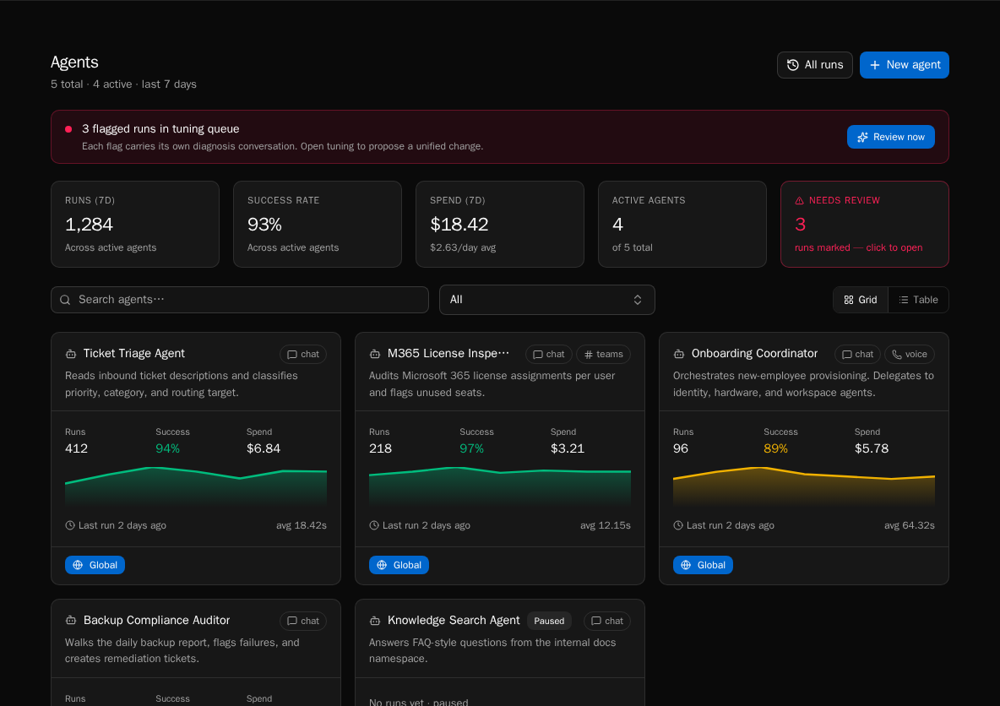

import { Aside, Steps } from '@astrojs/starlight/components';

The **Agents** page is your fleet dashboard. It lists every agent (active and paused), shows fleet-wide metrics, surfaces runs that need review, and supports both grid and table views.

<Aside type="caution" title="Fleet management is v0.7+">
Multi-agent fleet metrics, the **Needs review** card, fleet-wide spend rollups, and the bulk **Review now** banner ship in v0.7. On older deployments the page renders only individual agent cards without the top stat row. The per-agent flows on this page work on every version.
</Aside>

## View the dashboard

<Steps>

1. Click **Agents** in the sidebar. The page loads with the grid view by default.

2. The top stat row summarizes fleet activity over the last seven days: **Runs**, **Success rate**, **Spend**, **Active agents**, and **Needs review**.

3. The **Needs review** card highlights flagged runs across the fleet. Click **Review now** in the orange banner to jump straight to the review queue.

</Steps>

## Switch between grid and table view

<Steps>

1. Use the **Grid** / **Table** toggle in the toolbar. Grid is best for browsing; table is best for sorting and side-by-side stats.

2. Each grid card shows a runs sparkline plus mini-stats for runs (7d), success rate, spend, last-run time, and average duration.

3. The table view exposes the same metrics in sortable columns and surfaces channel badges (chat, voice, teams, slack).

</Steps>

## Search and filter

<Steps>

1. Type into the search box to filter by name or description. The list updates instantly.

2. Platform admins see an organization filter next to the search box. Choose **All organizations**, **Global**, or a specific org to scope the list.

3. Clear the search box to restore the full list.

</Steps>

## Pause and resume

<Steps>

1. Open an agent, then click **Pause** in the header. The agent stops accepting new runs immediately.

2. Paused agents stay in the fleet list with a **Paused** badge so you can find and reactivate them.

3. Click **Activate** in the header to resume.

</Steps>

<Aside type="note">
Calling `agents.run()` against a paused agent raises `AgentPausedError` — workflow code can catch this and degrade gracefully instead of failing.
</Aside>

## Create a new agent

<Steps>

1. Click **New agent** in the top-right.

2. Fill in name, description, system prompt, channels, tools, and knowledge sources.

3. Save. The agent is created with `is_active=true` and shows up immediately in the fleet.

</Steps>

See [Agents and Chat](/how-to-guides/ai/agents-and-chat) for field-level guidance and the SDK surface.

## Backfill summaries (admin)

<Steps>

1. Click **Backfill summaries** in the toolbar (platform admins only).

2. Confirm the cost estimate. Bifrost queues summary regeneration for any runs missing an `asked` / `did` summary.

3. Backfilled summaries roll up into `total_cost_7d`, so expect the **Spend (7d)** card to move proportionally.

</Steps>

## Next steps

- [Reviewing agent runs](/how-to-guides/agents/reviewing-runs)
- [Tuning an agent's behavior](/how-to-guides/agents/tuning-agents)
- [Filtering and finding runs](/how-to-guides/agents/run-history-and-filters)
