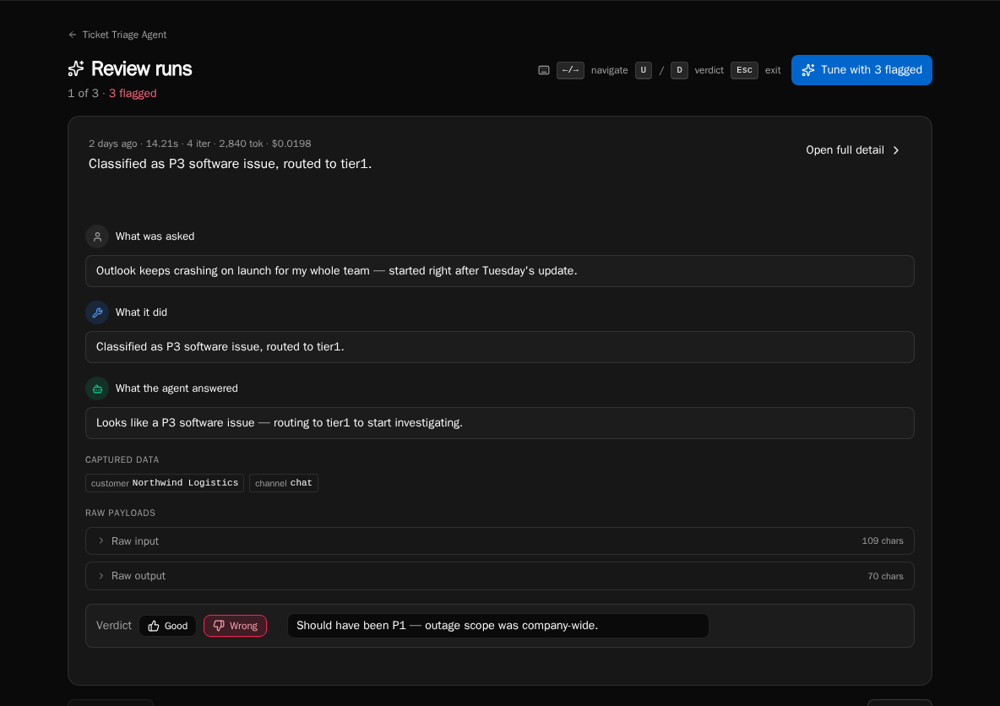

import { Aside, Steps } from '@astrojs/starlight/components';

The Review page is a focused queue for an agent's flagged runs. It pages through them one at a time so you can quickly decide whether each result was good, bad, or needs more thought — and feed the bad ones back into tuning.

## Open the review queue

<Steps>

1. From the agent's detail page, click **Review** (or open `/agents/{id}/review` directly).

2. The page loads with the agent's currently-flagged runs. The header shows the position counter (`3 of 12`) and the count of runs still flagged.

3. If nothing is flagged, you'll see the "Nothing to review" empty state — flag a run from the Runs tab first.

</Steps>

## Navigate the flipbook

<Steps>

1. Use the **Previous** / **Next** buttons or the dot pagination at the bottom to step through the queue.

2. Press **&larr;** / **&rarr;** (or **j** / **k**) on the keyboard to navigate without moving your hand to the mouse.

3. Press **Esc** to leave the queue and return to the agent detail page.

</Steps>

## Set a verdict

<Steps>

1. Read the run summary (`asked` / `did` blocks plus the response panel) on the current card.

2. Press **U** for thumbs-up (good) or **D** for thumbs-down (flagged for tuning). The verdict mutation auto-advances to the next run.

3. To remove a verdict, set it to "needs review" — clicking the same verdict again clears it.

</Steps>

<Aside type="note">
Setting thumbs-down doesn't queue automatic retraining — it adds the run to the agent's tuning input set. Open the **Tune** workbench to consolidate flagged runs into a single prompt proposal.
</Aside>

## Add a review note

<Steps>

1. Type a note in the verdict text field on the flipbook card. Notes are saved with the verdict.

2. The note appears on the run detail page and is included in the tuning conversation context.

3. Notes are optional but make consolidated tuning proposals dramatically better — they tell the LLM *why* the run was bad.

</Steps>

## Open full run detail

<Steps>

1. Click **Open full detail** in the flipbook card header to jump to `/agents/{id}/runs/{runId}` for the step-by-step timeline.

2. Use the browser back button to return to the same position in the flipbook.

</Steps>

## Move from review to tuning

<Steps>

1. When the header shows **N flagged**, click **Tune with N flagged** to jump into the tune workbench.

2. The workbench reads the same flagged set you just reviewed — your notes feed directly into the consolidated proposal.

</Steps>

## Next steps

- [Tuning an agent's behavior](/how-to-guides/agents/tuning-agents)
- [Filtering and finding runs](/how-to-guides/agents/run-history-and-filters)
