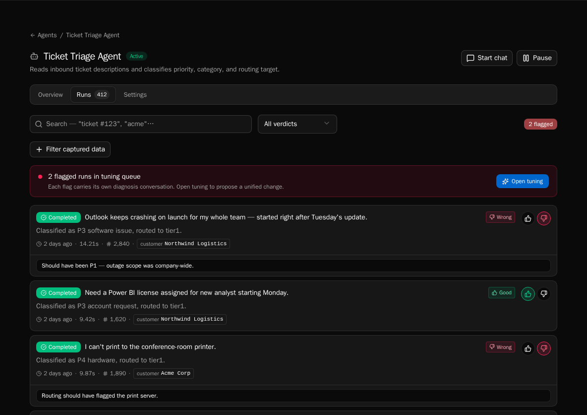
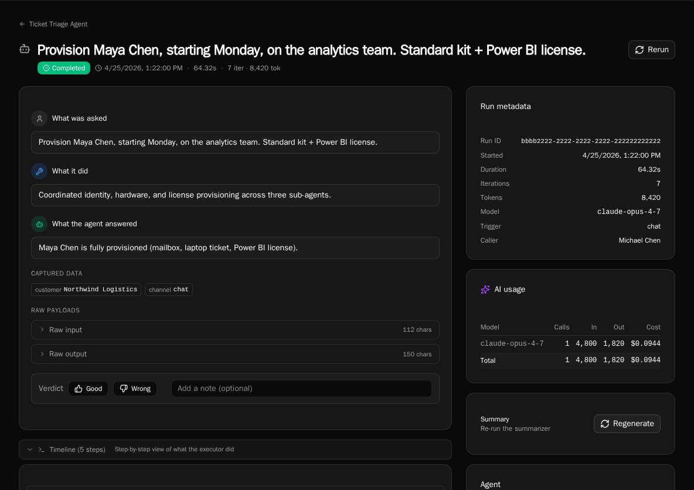

import { Aside, Steps } from '@astrojs/starlight/components';

Every agent run is tracked with full step-level observability. The Runs tab on the agent detail page (and the global **History → Agents** view) lets you search, filter, and drill into individual runs.

## Search runs by content

<Steps>

1. Open the agent's **Runs** tab.

2. Type into the search box. Search runs full-text across the `asked` summary, `did` summary, input payload, and final output.

3. Combine search with verdict and metadata filters — they stack.

</Steps>

## Filter by verdict

<Steps>

1. Use the **Verdict** filter to show only thumbs-up, thumbs-down, or unreviewed runs.

2. The Tune workbench and Review flipbook both default to `verdict=down` — this filter is the global view of the same set.

3. Clear the filter to see every run regardless of review state.

</Steps>

## Filter by metadata

<Steps>

1. Add metadata filters to scope by `trigger_type` (manual, webhook, schedule, workflow, rerun, delegation), status, model, or caller.

2. Combine with verdict and search to drill into a specific scenario — e.g., "all webhook-triggered runs that were flagged in the last 7 days."

3. Filters persist in the URL so you can share a filtered view.

</Steps>

## Drill into a delegation chain

<Steps>

1. Click any run to open its detail page.

2. Expand **Timeline** to see the step-by-step LLM calls and tool executions.

3. Delegation steps render as expandable rows — click to inline the child run's own steps without leaving the page. Child runs are filtered out of the top-level list, so the parent is the only entry point.

</Steps>

## Rerun a finished run

<Steps>

1. On the run detail page, click **Rerun**. This works on completed, failed, and cancelled runs.

2. Bifrost creates a new run with the same input, `trigger_type="rerun"`, and links back to the original. You're navigated to the new run.

3. Use rerun to validate that a tuning change actually fixes a flagged scenario.

</Steps>

## Cancel a running run

<Steps>

1. While a run is in `running` status, the run detail page exposes a **Cancel** button.

2. The run transitions `running` → `cancelling` → `cancelled`. Cancellation is checked before each iteration, during tool execution, and via a background watcher.

3. Cancelled runs can be rerun like any other terminal state.

</Steps>

## Regenerate a run summary (admin)

<Steps>

1. If a run's `asked` / `did` summary failed to generate, the run detail sidebar shows a **Regenerate** card. Platform admins also see this card on healthy runs.

2. Click **Regenerate** to re-queue the summarizer. The page polls and updates when the new summary lands.

3. Summaries cost a small amount per run — the **Spend (7d)** card on the fleet dashboard reflects regen cost.

</Steps>

<Aside type="note">
For bulk summary backfill (across many runs at once), use the **Backfill summaries** button on the fleet dashboard. It shows a cost estimate up front before queuing.
</Aside>

## Open the global runs view

<Steps>

1. Click **All runs** in the agent fleet header (or open `/history?type=agents`).

2. The global view spans every agent and supports the same search/verdict/metadata filters plus an agent picker.

3. Use it for fleet-wide audits, ROI analysis, and finding runs across agents you don't remember the name of.

</Steps>

## Next steps

- [Reviewing agent runs](/how-to-guides/agents/reviewing-runs)
- [Tuning an agent's behavior](/how-to-guides/agents/tuning-agents)
