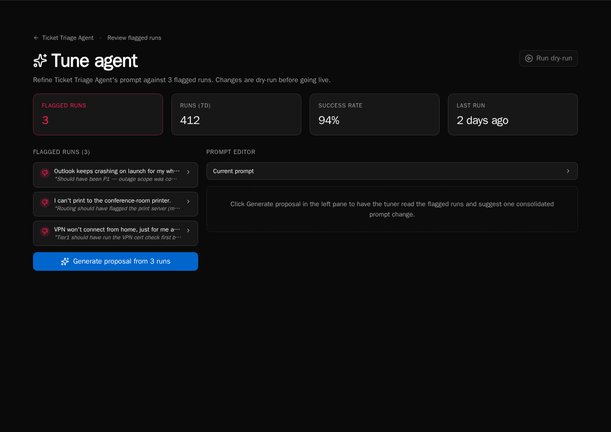

import { Aside, Steps } from '@astrojs/starlight/components';

The **Tune** workbench is where you turn flagged runs into a better system prompt. The page reads your flagged set, generates one consolidated prompt proposal, lets you dry-run it against the same flagged runs, and then applies the change live.

## Open the workbench

<Steps>

1. From the agent detail page click **Tune** (or visit `/agents/{id}/tune`).

2. The left pane lists every currently-flagged run with an expandable transcript so you can review the inputs the LLM will see.

3. The right pane is the prompt editor — empty until you generate a proposal.

</Steps>

## Generate a proposal

<Steps>

1. Click **Generate proposal from N runs**. The button is disabled if there are no flagged runs.

2. Bifrost reads the flagged transcripts and produces one consolidated proposal that addresses *all* of them, not one per run.

3. The proposal lands in the **Proposed prompt (editable)** pane. Edit freely — the diff updates live below the textarea.

</Steps>

<Aside type="tip">
Verdict notes from the review flipbook flow into proposal generation. Runs with "this should have asked for confirmation first" produce sharper proposals than runs flagged with no note.
</Aside>

## Compare current vs proposed

<Steps>

1. Expand **Current prompt** above the editor to see what's live today.

2. The diff viewer below the editor highlights additions, removals, and unchanged passages between current and proposed.

3. Edit the proposal until the diff matches your intent, then proceed to dry-run.

</Steps>

## Dry-run before applying

<Steps>

1. Click **Run dry-run** in the top-right header. The button is enabled once a proposal exists.

2. Bifrost replays each flagged run against the *proposed* prompt and reports whether the agent would have decided differently.

3. The results panel groups outcomes as **Would change** (good — the new prompt fixes the run) or **Still wrong** (bad — the proposal didn't address that case).

</Steps>

<Aside type="note">
Dry-runs use the same model as live runs but don't execute tools — they're a behavioral simulation, not a side-effect-producing replay. Confidence percentages reflect the LLM's own self-rating.
</Aside>

## Apply or discard

<Steps>

1. If the dry-run looks good, click **Apply live**. The new prompt is saved to the agent and takes effect for future runs immediately.

2. If you want to start over, click **Discard** to clear the proposal and re-generate from a different flagged set.

3. After applying, the page redirects back to the agent detail. Future runs use the new prompt.

</Steps>

## Iterate

<Steps>

1. Apply the prompt, let new runs accumulate, then mark any that still go wrong as flagged.

2. Return to **Tune** — the workbench will read the *new* flagged set and propose another consolidated revision.

3. Repeat until the agent's behavior matches what you want.

</Steps>

## Next steps

- [Reviewing agent runs](/how-to-guides/agents/reviewing-runs)
- [Filtering and finding runs](/how-to-guides/agents/run-history-and-filters)
