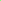
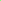
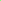
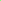

import { Aside, Steps } from '@astrojs/starlight/components';

Set up passwordless login using passkeys (WebAuthn) for secure, convenient authentication.

## What Are Passkeys?

Passkeys are a modern authentication method that replaces passwords:

- **Secure**: Based on public key cryptography
- **Phishing-resistant**: Bound to specific domains
- **Convenient**: Use fingerprint, face, or device PIN
- **Cross-platform**: Works on computers and mobile devices

## Enable Passkeys

<Steps>

1. Log in with your existing method (email/password or SSO)

2. Go to **Settings** > **Security**

   

3. In the **Passkeys** section, click **Add Passkey**

   

4. Follow your browser/device prompts:
   - Touch fingerprint sensor
   - Use Face ID
   - Enter device PIN

5. Name your passkey (e.g., "MacBook Pro", "iPhone")

   

6. Passkey is registered

   

</Steps>

<Aside type="tip">
Register passkeys on multiple devices for backup access.
</Aside>

## Login with Passkey

<Steps>

1. Go to the login page

2. Click **Sign in with Passkey**

3. Select your passkey from the browser prompt

4. Authenticate with fingerprint/face/PIN

5. You're logged in

</Steps>

## Managing Passkeys

View and manage your passkeys in **Settings** > **Security**:

- **View registered passkeys**: See all devices
- **Rename passkeys**: Give meaningful names
- **Delete passkeys**: Remove compromised or old devices

## Device Support

| Platform | Authentication Method |
|----------|----------------------|
| macOS | Touch ID, Apple Watch |
| Windows | Windows Hello (PIN, fingerprint, face) |
| iOS/iPadOS | Face ID, Touch ID |
| Android | Fingerprint, face, PIN |
| Security Keys | FIDO2 hardware keys |

## Security Considerations

- **Domain-bound**: Passkeys only work on the correct domain
- **No shared secrets**: Private key never leaves your device
- **Backup options**: Keep multiple passkeys registered
- **Recovery**: Ensure you have an alternative login method

<Aside type="caution">
If you lose access to all devices with passkeys, you'll need an alternative login method or admin assistance.
</Aside>

## For Administrators

### Enable/Disable Passkeys

Passkeys are enabled by default. Platform admins can configure authentication options in system settings.

### User Management

View users' registered passkeys in user management. Admins can:

- See how many passkeys a user has registered
- Assist users who lose access
- Revoke passkeys if needed

## Troubleshooting

### Passkey Not Recognized

- Ensure you're on the correct domain
- Try a different browser
- Check if the device supports WebAuthn

### Can't Register Passkey

- Update your browser to latest version
- Ensure platform authenticator is enabled
- Try using a hardware security key

### Lost All Passkeys

- Use alternative login method (password, SSO)
- Contact administrator for account recovery
