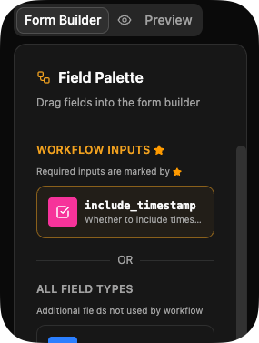
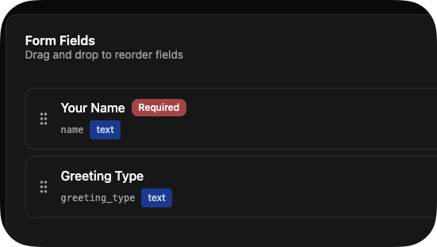
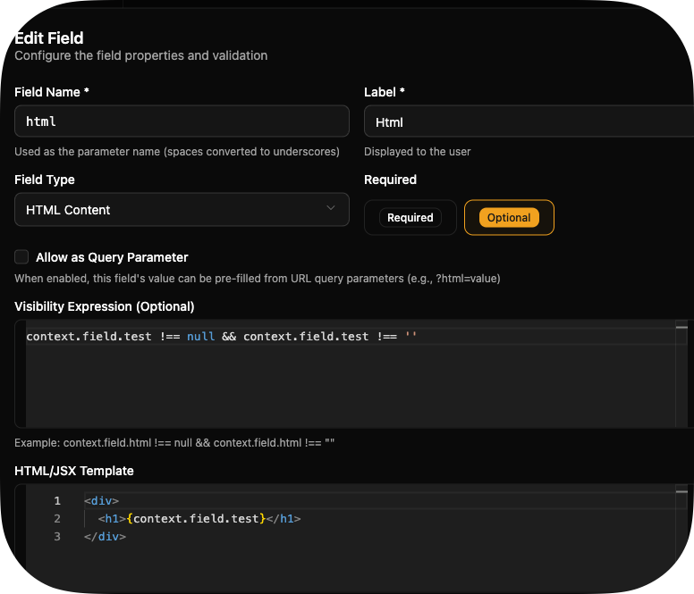

import { Aside, Tabs, TabItem } from "@astrojs/starlight/components";

## Creating a Form

**Forms** → **+** button → Fill in:

-   **Name**: Display name (max 200 chars)
-   **Linked Workflow**: Workflow to execute on submit
-   **Scope**: Global or Organization-specific

<Aside type="tip">
    Drag workflow parameters directly to canvas for auto-configured fields.
</Aside>

## Form Builder

**Left Panel**: Workflow parameters and field types



**Canvas**: Drag, drop, and reorder fields



## Unique Features

### Launch Workflows

Optional workflow that runs when form opens. Results available in `context.workflow.*` for visibility expressions and HTML templates.

**Use cases**:

-   Pre-populate field options based on user
-   Show/hide Dynamic Fields
-   Display personalized content

```javascript
// Example: Show field only for admins
context.workflow.is_admin === true;
```

### Visibility Expressions

Show/hide fields with JavaScript expressions:

```javascript
// Access form fields
context.field.country === "USA";

// Access launch workflow results
context.workflow.user_role === "manager";

// Access URL parameters
context.query.department !== null;
```



<Aside type="note">
    Click **Info** (ℹ️) button to preview available context data.
</Aside>

### Data Providers

Dynamically populate dropdowns from workflows.

<Tabs>
  <TabItem label="Simple" icon="list">
Select a data provider from the dropdown. Options load when form opens.
  </TabItem>

  <TabItem label="Parameterized" icon="setting">
If provider needs parameters, configure how to provide them:

| Mode                | Description              |
| ------------------- | ------------------------ |
| **Static**          | Hard-coded value         |
| **Field Reference** | Value from another field |
| **Expression**      | JavaScript expression    |

**Example**: Managers dropdown updates when user selects department.

  </TabItem>
</Tabs>

### HTML Content Fields

Display dynamic content with full context access:

```jsx
<div className="p-4 bg-blue-50 rounded">
    <h3>Welcome, {context.workflow.user_email}!</h3>
    {context.workflow.is_admin && (
        <p className="text-red-600">Admin Access Enabled</p>
    )}
</div>
```

Features: React-style className, conditional rendering, full context access.

### Query Parameters

Pre-fill form fields from URL:

```
/execute/form-id?email=user@example.com&dept=IT
```

Enable per-field in configuration → **Allow as Query Parameter**

Access via `context.query.field_name` in expressions.

### File Uploads

**Settings**: Allowed types (`.pdf`, `image/*`), max size, multiple files

**Returns** to workflow:

```json
[
    {
        "filename": "document.pdf",
        "content_type": "application/pdf",
        "size_bytes": 1024000,
        "sas_uri": "https://..."
    }
]
```

The `sas_uri` is a secure, time-limited URL.

## Best Practices

-   **Drag workflow parameters first**: Auto-configures fields correctly
-   **Keep expressions simple**: Easier to maintain and debug
-   **Use static options when possible**: Faster than data providers
-   **Limit HTML templates**: Can impact performance
-   **Test visibility expressions**: Use context viewer to debug

## Troubleshooting

**Fields not appearing**: Check visibility expression returns true, use context viewer

**Data provider empty**: Verify provider exists, check required parameters

**Launch workflow not running**: Verify workflow selected and parameters provided

## Next Steps

-   [Data Providers](/how-to-guides/forms/data-providers) - Dynamic dropdown options
-   [Visibility Rules](/how-to-guides/forms/visibility-rules) - Conditional field display
