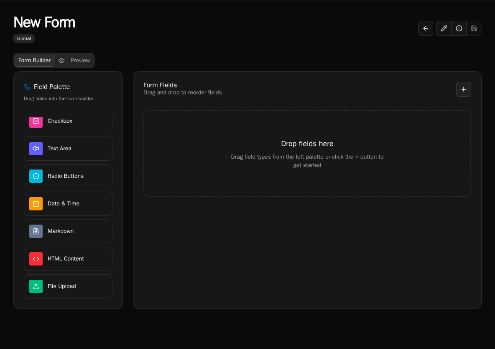

import { Aside, Tabs, TabItem } from "@astrojs/starlight/components";

Personalized Messages, instructions, or context to users when they open a form. Pull data from launch workflows to show user names, organization info, status messages, and more.

## What You'll Build

A form that displays a personalized welcome message showing:

-   User's name and organization
-   Custom content based on user role
-   Dynamic instructions based on form context

## Prerequisites

-   Form with launch workflow configured
-   Basic understanding of JSX syntax

## Add HTML Content Field



1. Open form in builder
2. Drag **HTML Content** field from field palette
3. Enter your JSX template in the **Content** field
4. Save field

## Basic Welcome Message

Display user info from launch workflow:

```jsx
<div className="p-4 bg-blue-50 rounded-lg border border-blue-200">
    <h2 className="font-bold text-lg mb-2">Welcome!</h2>
    <p className="text-gray-700">
        Hello {context.workflow.user_name}, you're submitting a request for{" "}
        {context.workflow.organization_name}.
    </p>
</div>
```

<Aside type="note">
    Data comes from your launch workflow. If `context.workflow.user_name` is
    undefined, verify your launch workflow returns these fields.
</Aside>

## Conditional Messages

Show different content based on user role:

```jsx
{
    context.workflow.is_admin ? (
        <div className="p-4 bg-blue-50 border border-blue-200 rounded-lg">
            <p className="font-semibold">Admin Access</p>
            <p className="text-sm text-gray-700">
                You can approve requests and manage settings.
            </p>
        </div>
    ) : (
        <div className="p-4 bg-gray-50 border border-gray-200 rounded-lg">
            <p className="font-semibold">Standard Access</p>
            <p className="text-sm text-gray-700">
                Your request will be reviewed by an administrator.
            </p>
        </div>
    );
}
```

## Display Lists

Show array data from launch workflow:

```jsx
<div className="p-4 bg-white border border-gray-200 rounded-lg">
    <p className="font-semibold mb-2">Your Organizations:</p>
    <ul className="list-disc ml-5 space-y-1">
        {context.workflow.organizations?.map((org, i) => (
            <li key={i} className="text-gray-700">
                {org.name}
            </li>
        ))}
    </ul>
</div>
```

## Status-Based Styling

Change appearance based on data:

```jsx
<div
    className={`p-4 rounded-lg border ${
        context.workflow.account_status === "active"
            ? "bg-green-50 border-green-200"
            : "bg-yellow-50 border-yellow-200"
    }`}
>
    <p className="font-semibold">
        Account Status: {context.workflow.account_status}
    </p>
    {context.workflow.account_status !== "active" && (
        <p className="text-sm text-gray-600 mt-1">
            Contact support to activate your account.
        </p>
    )}
</div>
```

## Context-Based Instructions

Show instructions based on form field selections:

```jsx
{
    context.field.request_type === "urgent" && (
        <div className="p-4 bg-red-50 border border-red-200 rounded-lg">
            <p className="text-red-900 font-semibold">⚠️ Important</p>
            <p className="text-sm text-red-800 mt-1">
                Urgent requests require manager approval before submission.
            </p>
        </div>
    );
}
```

## Available Context

Access data in your HTML templates:

<Tabs>
  <TabItem label="Launch Workflow Data" icon="star">
```jsx
// Any data returned by launch workflow
context.workflow.user_name
context.workflow.organization_name
context.workflow.is_admin
context.workflow.permissions
```
  </TabItem>

{" "}

<TabItem label="Form Field Values" icon="seti:text">
    ```jsx // Current form field values context.field.email
    context.field.department context.field.request_type ```
</TabItem>

  <TabItem label="Query Parameters" icon="information">
```jsx
// URL query params (if enabled)
context.query.customer_id
context.query.source
```
  </TabItem>
</Tabs>

## Styling with Tailwind

Use Tailwind CSS classes via `className` (React style):

```jsx
<div className="p-4 bg-blue-50 border border-blue-200 rounded-lg">
    <h3 className="font-bold text-lg mb-2">Title</h3>
    <p className="text-gray-700">Content text here.</p>
</div>
```

Common utilities:

-   **Spacing**: `p-4` (padding), `mb-2` (margin bottom), `space-y-2` (vertical spacing)
-   **Colors**: `bg-blue-50` (background), `text-gray-700` (text color), `border-blue-200` (border)
-   **Layout**: `rounded-lg` (rounded corners), `border` (border), `font-bold` (bold text)
-   **Responsive**: `grid-cols-1 md:grid-cols-2` (responsive grid)

## Common Patterns

### User Greeting with Account Info

```jsx
<div className="p-6 bg-gradient-to-r from-blue-50 to-blue-100 rounded-lg border border-blue-200">
    <h2 className="text-xl font-bold text-gray-900 mb-2">
        Welcome back, {context.workflow.user_name}!
    </h2>
    <div className="space-y-1 text-sm text-gray-700">
        <p>Organization: {context.workflow.organization_name}</p>
        <p>Role: {context.workflow.role}</p>
        <p>Last login: {context.workflow.last_login}</p>
    </div>
</div>
```

### Alert Based on Status

```jsx
<div className="p-4 bg-yellow-50 border-l-4 border-yellow-400 rounded">
    <div className="flex">
        <div className="flex-shrink-0">
            <span className="text-2xl">⚡</span>
        </div>
        <div className="ml-3">
            <p className="text-sm font-medium text-yellow-800">
                {context.workflow.alert_message}
            </p>
        </div>
    </div>
</div>
```

### Permission List

```jsx
<div className="p-4 bg-white border border-gray-200 rounded-lg">
    <p className="font-semibold text-gray-900 mb-2">Your Permissions:</p>
    {context.workflow.permissions?.length > 0 ? (
        <ul className="list-disc ml-5 space-y-1">
            {context.workflow.permissions.map((perm, i) => (
                <li key={i} className="text-sm text-gray-700">
                    {perm}
                </li>
            ))}
        </ul>
    ) : (
        <p className="text-sm text-gray-500">No permissions assigned.</p>
    )}
</div>
```

## Safe Null Checking

Always check if data exists before using it:

```jsx
{
    /* Show only if value exists */
}
{
    context.workflow.optional_message && (
        <p>{context.workflow.optional_message}</p>
    );
}

{
    /* Use fallback value */
}
<p>Name: {context.workflow.name || "Not provided"}</p>;

{
    /* Safe navigation for nested properties */
}
<p>Email: {context.workflow.user?.email || "No email"}</p>;

{
    /* Check array before mapping */
}
{
    context.workflow.items?.map((item, i) => <div key={i}>{item.name}</div>);
}
```

## Troubleshooting

**Content not displaying**: Check JSX syntax. Use `className` not `class`. Verify all tags are closed.

**Values showing as undefined**: Click **Info** button in form builder to preview available context. Verify launch workflow returns expected data.

**Styling not working**: Use `className` attribute (React style). Check Tailwind class names are correct.

**JavaScript error**: Check for unmatched braces `{}`, missing commas, or undefined variables in expressions.

## Tips

1. **Test with Info button**: Click Info in form builder to see actual context data
2. **Use browser console**: Open DevTools to see JavaScript errors
3. **Keep it simple**: Start with basic text, add styling gradually
4. **Format values**: Use `.toUpperCase()`, `.toFixed(2)`, or `new Date().toLocaleDateString()` for formatting
5. **Use conditional rendering**: Show/hide content with `&&` or ternary operators

## Next Steps

-   [Show Fields Based on User Permissions](/how-to-guides/forms/visibility-rules) - Control field visibility
-   [Cascading Dropdowns](/how-to-guides/forms/cascading-dropdowns) - Dynamic form fields
-   [Startup Workflows](/how-to-guides/forms/startup-workflows) - Load context data
