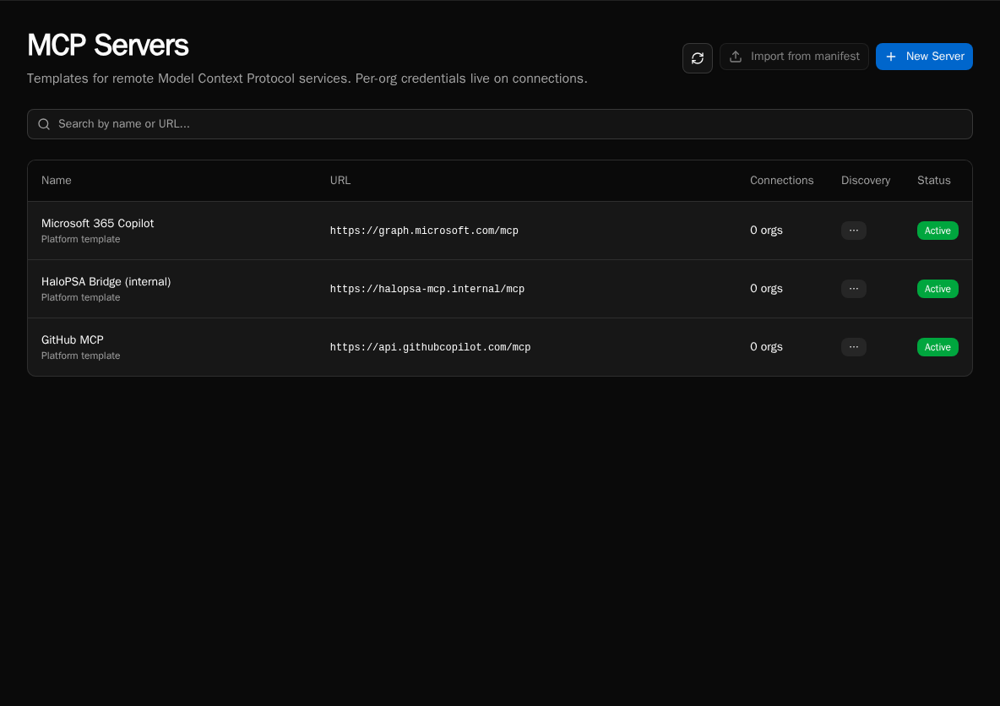
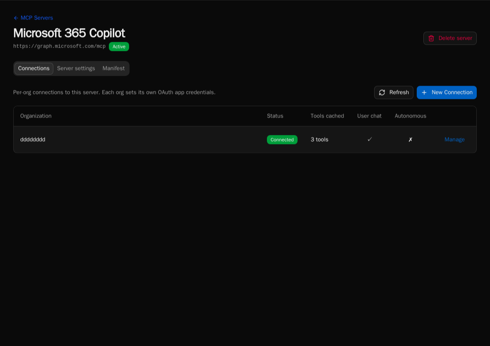
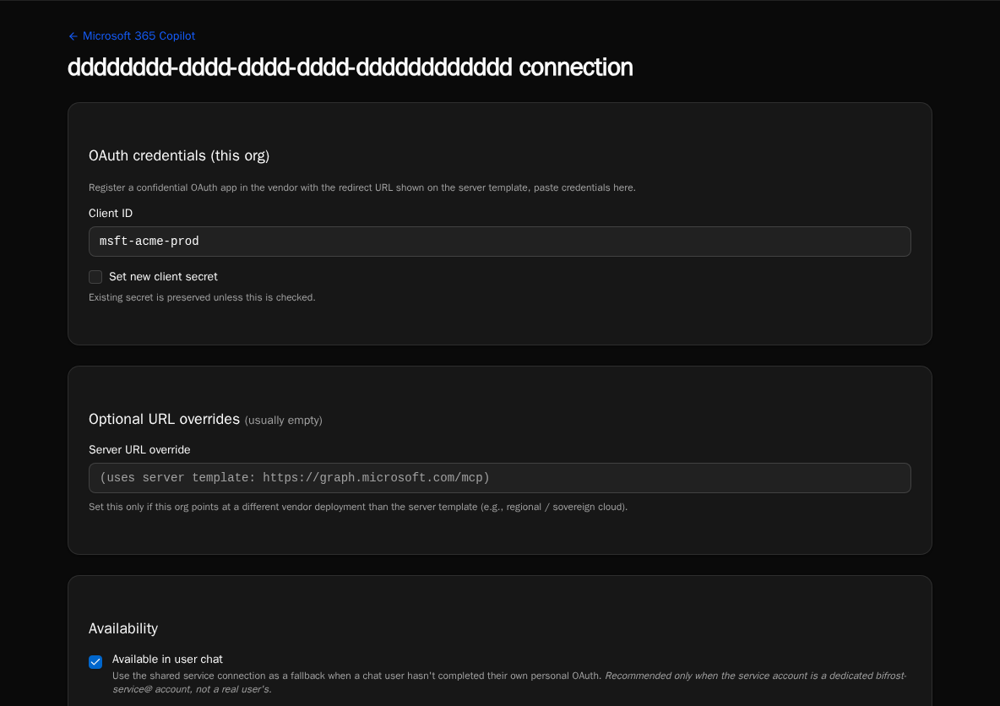
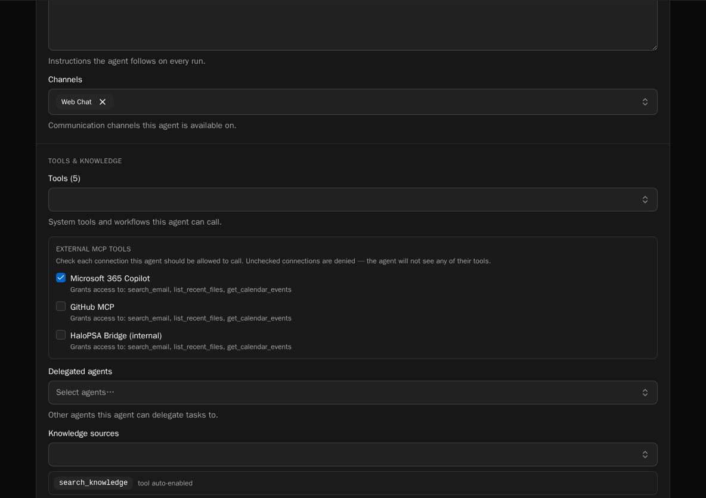

import { Aside, Steps } from '@astrojs/starlight/components';

Bifrost can connect to remote MCP servers and surface their tools to your agents and chat. This page walks a platform admin through the full setup: register a server template, create a connection, configure visibility, and grant the connection to specific agents.

For the why and where this fits, see [MCP core concept](/core-concepts/mcp/).

## Prerequisites

- Platform admin role on your Bifrost instance.
- An MCP-compliant remote server reachable over HTTPS (streamable HTTP transport — SSE and stdio are not supported).
- The remote server's OAuth metadata endpoints (`/.well-known/oauth-authorization-server` and/or `/.well-known/oauth-protected-resource`), or its authorize/token URLs if discovery isn't available.

## Step 1: Register a server template

A server template captures the URL, OAuth provider, and discovery snapshot. It's platform-level — defined once, available to every organization.

<Steps>

1. Go to **MCP Servers** in the sidebar (platform admins only). Click **New Server**.

2. Enter the server's display name and base URL. Bifrost fetches the well-known discovery documents and pre-fills the OAuth metadata.

3. If discovery fails (the server doesn't publish well-known endpoints), switch to **Manual** and enter the authorize URL, token URL, scopes, and token endpoint auth method by hand.

4. Pick the OAuth flow:
   - **Authorization Code (PKCE)** — for servers that delegate to a user identity (M365 Graph, GitHub, anything with per-user consent).
   - **Client Credentials** — for service-to-service flows where Bifrost authenticates as itself (an internal MCP gateway, a back-office bridge).

5. Save. The template is now visible to every org's admins.

</Steps>

<Aside type="note">
The redirect URL Bifrost generates is shown on the form. Copy it into your OAuth provider's allowed-redirect list before continuing.
</Aside>

## Step 2: Create an organization connection

Each org admin then creates a **connection** binding their organization to the template.

<Steps>

1. From the server template page, click **New Connection**. Pick the organization.

2. Paste the OAuth `client_id` and `client_secret` issued by the remote server. The secret is encrypted at rest.

3. Click **Authorize**. Bifrost opens the remote server's consent screen, exchanges the code, and stores a service token.

4. Bifrost calls `tools/list` on the remote server and populates the connection's tool catalog. Each tool is admin-toggleable.

</Steps>

## Step 3: Set visibility flags

Each connection has two independent flags:

- **Available in user chat** — chat sessions can call these tools. If the calling user has no personal credential, falls back to the connection's service token (the vendor sees the service identity).
- **Available to autonomous agents** — scheduled or event-triggered agent runs can call these tools using the service token.

Both flags off means the connection exists but no one can use it. This is useful when you've registered a connection but haven't decided which surfaces should expose it yet.

## Step 4: Grant the connection to agents

External MCP connections are **default-deny per agent**. A new connection is invisible to every agent in the org until you explicitly grant it.

<Steps>

1. Open the agent's settings page → **MCP Connections** panel.

2. Tick the connections this agent is allowed to use. Untick to revoke.

3. Save. The agent's tool list updates on its next run.

</Steps>

<Aside type="caution">
The default-deny rule prevents a new connection (especially write-capable ones) from silently widening every agent's capability surface. If you're upgrading from a Bifrost version that didn't have per-agent grants, existing agents are backfilled with grants for existing connections — the upgrade is not a behavior change.
</Aside>

## Step 5 (optional): Personal user credentials

If you want chat users to act as themselves (vendor sees the user, not the service account), users connect their personal credentials separately. See [Connecting your personal MCP identity](/how-to-guides/mcp/per-user-mcp-credentials/).

## Tool result size cap

Bifrost caps each MCP tool response at ~250KB (~60K tokens) before passing it to the LLM. Oversized responses are replaced with a structured truncation message that nudges the model toward narrower filter parameters on retry. This protects context-window budgets when an external server returns a large dataset.

## Re-syncing the tool catalog

The connection page has a **Refresh tools** button that re-runs `tools/list` against the remote server. Manually-disabled tools stay disabled across re-syncs (they carry a `disabled_reason` flag) so you don't have to re-curate after every refresh.

## Removing a connection

Deleting a connection cascades to its tool catalog and to any user credentials scoped to it. Per-agent grants for the deleted connection are removed. Schedule the removal during a quiet window — autonomous agents that depended on its tools will start failing on their next run.
