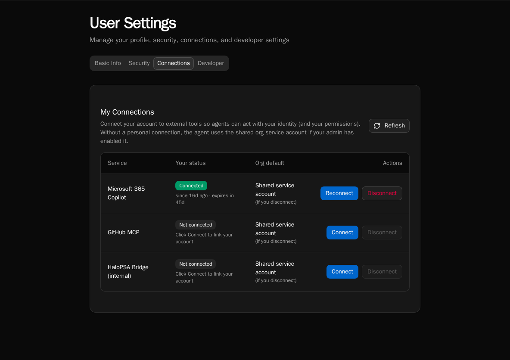

import { Aside, Steps } from '@astrojs/starlight/components';

When your platform admin has registered an external MCP server and granted it to an agent or chat, you can optionally connect your **personal** identity to it. With a personal connection, vendors (M365, GitHub, etc.) see your user and apply your permissions, not the service account's.

If you don't connect, calls fall back to the shared service token (assuming the connection has **Available in chat** turned on). For some servers — `client_credentials` flows like an internal HaloPSA bridge — there is no per-user mode and this page doesn't apply.

## Connect from settings

<Steps>

1. Open your **User Settings → MCP Connections**. The page lists every external MCP connection your org has access to.

2. Click **Connect** next to the server you want to authenticate as yourself.

3. Bifrost opens the server's OAuth consent screen. Sign in with your account and approve the requested scopes.

4. Back in Bifrost, the row switches to **Connected**. Future tool calls in chat use your token.

</Steps>

## Connect inline from chat

If an agent tries to call a tool that requires a personal credential and you don't have one yet, chat shows an inline **Connect** card. Click it to complete the OAuth flow, then re-send your message. The agent retries with your token.

## Disconnect

The settings page has a **Disconnect** button on each connected row. Disconnecting deletes your stored token; future calls fall back to the service token (if enabled) or fail with a needs-reauth prompt.

<Aside type="note">
Personal credentials are user-owned. Removing a server connection or template at the platform level does not delete user credentials proactively, but they become unusable.
</Aside>
