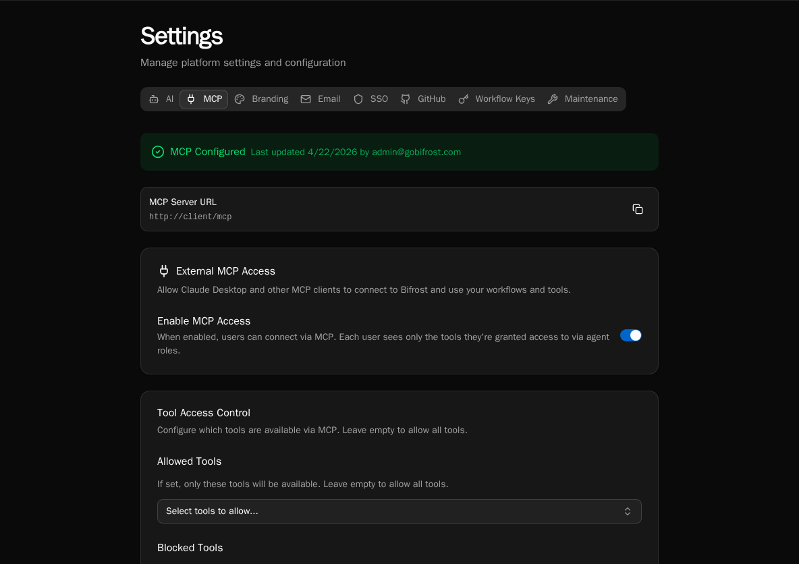

import { Aside, Steps } from '@astrojs/starlight/components';

Bifrost ships with a built-in [Model Context Protocol](https://modelcontextprotocol.io) server. Once enabled, any MCP-aware client (Claude Desktop, Copilot, Cursor, Open WebUI) can connect with a Bifrost user account and call workflows, manage forms, search knowledge, and more.

## What MCP exposes

When enabled, Bifrost exposes:

- **Workflow tools** — every workflow tagged `is_tool=True` (or `@tool`) appears as an MCP tool with normalized name, e.g. `lookup_customer`.
- **System tools** — `list_workflows`, `execute_workflow`, `list_forms`, `create_form`, `search_knowledge`, file/code editing tools, agent CRUD, and more (~50+ built-ins).
- **Per-user scoping** — the connecting user's roles determine which tools they see. Non-admins without matching roles connect successfully but see an empty tool set rather than a 403.

## Enable the MCP server

<Steps>

1. Go to **Settings → MCP**. The page shows the public **MCP Server URL** (`https://your-instance/mcp`) and current configuration status.

2. Toggle **Enable MCP Access** on. Per-user visibility is enforced by role; the toggle is a global kill-switch.

3. Click **Save Configuration**. The status banner switches to **MCP Configured**.

</Steps>

<Aside type="note">
MCP no longer requires platform-admin to *connect*. Any authenticated user can connect — they just see only the tools their roles grant. Admins still configure the global enable switch and tool allow/block lists.
</Aside>

## Restrict the tool surface

By default, every available tool is exposed. Use **Allowed Tools** and **Blocked Tools** to narrow the surface.

<Steps>

1. On the **Settings → MCP** page, scroll to **Tool Access Control**.

2. Use **Allowed Tools** to whitelist specific tools — leave empty to allow all. Picking even one tool flips the list to allow-only mode.

3. Use **Blocked Tools** to subtract tools regardless of the allow list. Useful for hiding `delete_*` or `replace_*` operations from production.

4. Save. Connected clients pick up the new surface on their next tool list refresh.

</Steps>

## Confirm the server is reachable

<Steps>

1. Copy the **MCP Server URL** from the settings page.

2. Hit `GET <url>/.well-known/oauth-authorization-server/mcp` from any HTTP client. You should see a JSON document advertising the OAuth endpoints (issuer, authorization_endpoint, token_endpoint).

3. The discovery endpoints serve cross-origin (CORS-enabled) so browser-based clients can connect without a proxy.

</Steps>

## How auth works

Bifrost implements OAuth 2.1 with PKCE (RFC 7636), dynamic client registration (RFC 7591), and discovery (RFC 8414 / 9728). When a client connects:

1. The client hits `/register` with its name + redirect URIs and gets a `client_id`.
2. The client sends the user to `/authorize`. Bifrost redirects to its login page if the user isn't already signed in.
3. After login Bifrost issues an authorization code, the client exchanges it at `/token` with PKCE, and gets a Bifrost access token.
4. Subsequent MCP requests carry that token; tool visibility is filtered against the user's roles.

Tokens expire after 30 minutes. Clients refresh transparently with the issued refresh token.

## Roles and tool visibility

Tool visibility is computed per request from the connecting user's roles. To grant a user access to a workflow tool:

1. Tag the workflow `is_tool=True` (or `@tool`) and assign it to an agent.
2. Set the agent's **Access Level** to **Role-based** and assign the right roles.
3. Add the user to one of those roles. They will see the tool on next reconnect.

System tools (file ops, agent CRUD, etc.) follow the same role check via the agent's `system_tools` allow list.

## Next steps

- [Connecting Claude Desktop, Copilot, Cursor, and Open WebUI](/how-to-guides/mcp/connecting-clients)
- [Publishing agents as MCP tool providers](/how-to-guides/mcp/agents-as-mcp)
