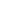
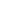

import { Aside } from '@astrojs/starlight/components';

The **Audit Log** is the structured trail of who did what across the platform — who logged in, who created a role, who connected an integration. It replaced the older free-form `system_logs` stream and is the canonical record for compliance reviews and incident triage.

<Aside type="caution">
The audit log is **platform-admin only**. Org admins do not see other orgs' actions.
</Aside>

## Open the page

Navigate to **Settings → Audit Log**, or go directly to `/audit`.



## What's tracked

Every entry is a **dotted action name** plus context. Actions group by the entity they touch:

| Group | Examples |
|---|---|
| `auth.*` | `auth.login.success`, `auth.login.failed`, `auth.logout`, `auth.passkey.add` |
| `user.*` | `user.create`, `user.update`, `user.delete`, `user.role.assign` |
| `role.*` | `role.create`, `role.update`, `role.delete`, `role.permission.update` |
| `organization.*` | `organization.create`, `organization.update`, `organization.delete` |

Each row carries:

- **Timestamp** (UTC, displayed in browser local time)
- **Action** (the dotted name)
- **Outcome** — `success` or `failure`
- **Actor** — user email + display name. For non-HTTP events (SSO sync, scheduler, CLI), the source is shown in parens, e.g. `(sso_sync)`.
- **Resource** — entity type + truncated ID (e.g. `user / 12345678`)
- **IP address** — for HTTP-originated events
- **Details** — event-specific JSON metadata

The list is **append-only**: audit rows are written in the same database transaction as the action they record, so you can't have a successful state mutation without a corresponding audit row.

<Aside>
Workflow execution and integration sync events are *not* in the audit log — those live in **Execution History** and the per-integration sync log respectively. The audit log is for control-plane mutations (auth, identity, RBAC, org lifecycle).
</Aside>

## Filtering



The filter bar above the table:

- **Action group** — dropdown: All, Authentication, Users, Roles, Organizations. Selecting a group filters server-side by the action prefix (`auth.`, `user.`, etc.).
- **Outcome** — All, Success, or Failure. Use **Failure** to spot brute-force login attempts or permission errors that shouldn't be happening.
- **Search box** — client-side filter over the current page. Matches action name, actor email/name, resource type, and IP. Use this to scope to a specific user or IP within a date range you've already loaded.
- **Start / End date** — server-side date-range filter (UTC).

Click the **Refresh** icon at the right to re-fetch with the current filters.

## Pagination

The table loads 50 rows per page, newest first. Use **Previous** / **Next** at the bottom — the implementation uses opaque continuation tokens, so jumping to an arbitrary page isn't supported (this is intentional for a large append-only log; date-range filtering is the right tool to narrow down).

## Retention

Audit rows are written to the `audit_logs` table and are **not pruned by the platform**. Retention is whatever your database backup / archival policy enforces — Bifrost itself does not auto-delete old rows, and there is no `AUDIT_LOG_RETENTION` env var.

If you have compliance retention requirements (e.g. "delete after 7 years"), schedule a database-level cleanup job against `audit_logs` matching your policy. The table is keyed on `timestamp` for fast range deletes.

## Export

There is no built-in CSV/JSON export button on the page. To export audit data programmatically, hit the API directly:

```bash
curl -H "Authorization: Bearer $TOKEN" \
  "$BIFROST_URL/api/audit?start_date=2026-01-01&end_date=2026-01-31&limit=1000"
```

The response is paginated JSON (same shape the UI consumes); follow `continuation_token` for additional pages. Pipe through `jq` to flatten to CSV for spreadsheet ingestion.

## Common queries

**"Who created this user?"**
Filter **Action group: Users**, search the user's email, look for the `user.create` row. The actor column shows who did it.

**"Are we under password-spray attack?"**
Filter **Action group: Authentication, Outcome: Failure** and scan the IP column. Repeated failures from the same IP across many actor emails is the signal.

**"Who changed permissions on this role?"**
Filter **Action group: Roles**, search the role's name in the search box. Look for `role.permission.update` rows; the `details` JSON includes the diff.

## See also

- [Diagnostics](/how-to-guides/operations/diagnostics/) — process pool / worker health
- [Permissions](/core-concepts/permissions/) — what the actions in the log are gating
- [Configure SSO](/how-to-guides/authentication/sso/) — SSO sync events appear with `source: sso_sync`
