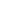
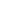
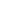

import { Aside } from '@astrojs/starlight/components';

The **Diagnostics** dashboard is the operator-facing view into Bifrost's worker containers, fork-based process pools, queue depth, and live memory usage. It's the first place to look when executions are slow, queueing up, or crashing.

<Aside type="caution">
Diagnostics is **platform-admin only**. Org users don't see the page at all.
</Aside>

## Audience

This guide is for self-hosted operators and on-call engineers who need to:

- Confirm worker containers are connected and healthy
- Spot a hot fork that's chewing memory before it OOM-kills
- Triage backlog when the queue depth alert fires
- Trace which worker ran a specific execution

If you're a workflow author looking at a single failed run, use the **Execution History** page instead.

## Open the dashboard

Navigate to **Settings → Diagnostics**, or go directly to `/diagnostics`.

The page has one tab today (**Process Pools**). The header shows a **Live** indicator when the WebSocket worker stream is connected — if it says "Connecting…" instead, REST snapshots will still populate the page but you won't get sub-second updates.

## What it shows

### Summary header

The right-hand summary reports `N container(s) · M fork(s)`:

- **Container** — one Bifrost worker pod / container. Each container registers itself on startup over Redis.
- **Fork** — one OS-level worker process inside a container. Workflows run in forks; each fork executes one task at a time.

If you're sized for 4 containers × 8 forks, you should see `4 containers · 32 forks`. Anything lower means a pod has died or hasn't registered yet — check the pod's logs.

### Queue badge

The badge next to the **Live** indicator shows the current depth of the execution queue (RabbitMQ). A small backlog (single digits) is normal during bursts. Sustained double-digit backlogs mean you don't have enough fork capacity for the incoming rate — scale workers, raise pool size, or look for a slow workflow.

### Memory chart

A live time-series of total RSS per container, color-coded per worker. The chart retains the last few minutes of data and updates as WebSocket heartbeats arrive.

**Numbers worth alerting on:**

- **Sustained climb on a single container** while others are flat — usually a workflow leaking memory in a fork. The Container Table will show which fork is holding the bag.
- **All containers near their pod memory limit** — you're undersized for the workload. Add containers or reduce `WORKER_POOL_SIZE`.
- **Sawtooth pattern** — forks are being recycled (good — process-pool memory pressure is being reclaimed). Steep teeth mean a single workflow is grabbing a lot of RSS per run; consider chunking it or tightening its data handling.

### Container table

One row per container, expandable to show its forks. Per fork you see:

| Column | Meaning |
|---|---|
| **PID** | OS process ID inside the container. |
| **State** | `idle`, `busy`, `terminating`, or `killed`. A fork stuck in `busy` for a long time is the most common smell. |
| **Memory (RSS)** | Resident set size in MB. Compare to the container's pod memory limit. |
| **Current execution** | Execution ID being processed, if any. Click through to the execution detail page. |
| **Uptime** | How long this fork has been alive since the last spawn/recycle. |

A fork that's been `busy` for longer than your `WORKFLOW_TIMEOUT` is wedged — either the workflow is in a tight loop or `asyncio` is blocked on a sync call. Kill the pod and inspect the worker logs.

## Refreshing the data

Two paths:

- **REST snapshot** — the page mounts with a one-shot `/api/workers/pools` call so the table is populated immediately even if the WebSocket hasn't connected yet.
- **WebSocket heartbeats** — each container streams its state every few seconds; the table merges in updates by `worker_id`. The **Live** dot pulses green while connected.

Click the **Refresh** button in the top-right to force a REST snapshot if you suspect the live stream is stale.

## Common ops scenarios

**"Queue depth is climbing and won't drain."**
Check the container table for forks stuck `busy`. If most forks are idle, your bottleneck isn't workers — look at the API or RabbitMQ. If most are busy with the same workflow path, that workflow is the choke point.

**"A pod just OOM-killed."**
Pull the memory chart — you'll see the climbing line right up to the kill. Cross-reference the fork that was busy at that timestamp with the **Current execution** column to identify the workflow. File a ticket against that workflow author with the execution ID.

**"WebSocket says connecting forever."**
The browser tab is talking to the API; the API is talking to Redis to gather worker heartbeats. If the dot never goes green, check `redis-cli ping` from the API pod, then restart the pod.

## What it doesn't show

The diagnostics surface intentionally only covers the **execution worker pool**. It does **not** show:

- Scheduler health (use scheduler logs / the deferred execution promoter, see [Scheduled Executions](/how-to-guides/workflows/scheduled-executions/))
- API request rates (use your reverse-proxy / APM)
- Database / RabbitMQ / S3 health (those are infrastructure dashboards)
- Per-workflow latency or token spend (use [Usage Reports](/how-to-guides/operations/usage-reports/))

## See also

- [Audit Log](/how-to-guides/operations/audit-log/) — who did what
- [Usage Reports](/how-to-guides/operations/usage-reports/) — AI cost, CPU, peak memory
- [Versions and Compatibility](/about/versioning/) — pinning workers to a known-good build
