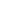
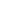
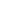

import { Aside } from '@astrojs/starlight/components';

Bifrost ships two complementary reporting surfaces:

- **Usage Reports** (`/usage`) — what the platform actually consumed: AI tokens, AI dollars, CPU seconds, peak RSS, knowledge storage. Useful for **cost** conversations.
- **ROI Reports** (`/reports/roi`) — how much human time and dollar value the platform saved. Useful for **value** conversations.

Both surfaces are visible to platform admins for any org; org admins see only their own org's slice.

## Usage Reports

Navigate to **Reports → Usage Reports**, or go directly to `/usage`.



### Filters

The **Report Period** card at the top controls everything below it:

- **Date range** — defaults to last 30 days. The trends chart respects this range; the workflow / conversation / agent tables sum across it.
- **Source tabs** — `All`, `Executions`, `Chat`, `Agents`. Toggling source hides irrelevant tables (e.g. **Chat** hides the workflow table) so you can focus on one cost driver at a time.
- **Organization** (platform admins) — filter to a single org or look across all orgs at once. Choosing **All organizations** also surfaces a **By Organization** table at the bottom.

### Summary cards

Across the top: **Total AI cost**, **Input tokens**, **Output tokens**, **AI calls**, **Total CPU seconds**, **Peak memory**. The cards reflect the active filters.

### Trends chart

A daily line chart of AI cost and token usage across the date range. Use it to spot:

- A sudden cost spike on a single day (usually a runaway agent or a misconfigured workflow firing on every webhook)
- A weekly weekend dip (normal — the chart is in UTC, so weekend = expected)
- A gradual climb (capacity planning signal)

### By-workflow / By-conversation / By-agent tables



Each table sorts by AI cost descending. The **AI cost** column is broken out **per model** — you'll see Claude Opus, Sonnet, GPT-4o, etc. listed separately for the same workflow if it called more than one provider during the date range. This makes it obvious when a workflow is paying Opus prices for a Haiku-class job.

Provider pricing is **auto-synced** — Bifrost periodically refreshes its model price table from a central source, so cost numbers reflect current per-token rates without operator intervention. There is no manual step to keep pricing accurate.

### By-organization table

Visible only when **Organization** is set to *All organizations*. Sorts orgs by their AI spend so you can identify the heavy hitters across a multi-tenant deployment.

### Knowledge storage table

Shows S3 / vector-DB bytes consumed per knowledge collection. Useful when storage costs become a line item.

### Demo Mode

Platform admins see a **Show Demo Data** toggle in the header. Flipping it on replaces the real data with deterministic sample data — handy for screenshots or demos when your real data is sparse or sensitive. The amber banner makes it obvious you're in demo mode.

## ROI Reports

Navigate to **Reports → ROI**, or go directly to `/reports/roi`.



ROI is configured per workflow at authoring time:

```python
@workflow(
    roi_minutes_saved=15,
    roi_dollar_value=25,
)
async def triage_ticket():
    ...
```

Each successful execution multiplies its workflow's `roi_minutes_saved` and `roi_dollar_value` into the totals you see on the report. The page surfaces:

- **Total time saved** (hours)
- **Total dollar value**
- **Trend chart** — daily roll-up
- **By workflow** table — sortable by executions, time, or value
- **By organization** table — when scoped to all orgs
- **Export** — download the current view as CSV

<Aside>
ROI numbers are only as accurate as the per-workflow estimates. Treat them as a **direction-of-travel** signal, not a forensic accounting record. A workflow that runs but produces a no-op result still bumps the counters — you're responsible for marking it `success` or `failure` correctly inside the workflow body.
</Aside>

## Where agent costs land

Autonomous agent runs generate `AIUsage` rows that roll into both reports:

- **Usage Reports** → the **By Agent** table groups by `agent_id`, with per-model breakdown.
- The **Spend (7d)** card on each agent's detail page (`/agents/:id`) reads from `AgentStats.total_cost_7d`, which is the same `AIUsage` data summed over the trailing 7 days. Backfilling summaries on N runs (via `POST /api/agent-runs/backfill-summaries`) will move that card by roughly `N × (avg summarizer cost per run)` — the API surfaces a cost estimate before you confirm.

## Common questions

**"Why is this workflow's AI cost so high?"**
Open Usage Reports → set Source to **Executions** → expand the workflow row to see the per-model breakdown. If 90% of the cost is on Opus calls, the workflow is over-modeling — refactor it to route easy paths to a cheaper model.

**"How much did we spend last month?"**
Set the date range to the previous month, leave Source on **All**, organization on **All organizations**. The **Total AI cost** summary card is your number.

**"Is the platform paying for itself?"**
Compare **Total AI cost** in Usage Reports against **Total dollar value** in ROI Reports for the same date range. A 10× or better ratio is the typical signal that automation is earning its keep.

## See also

- [Diagnostics](/how-to-guides/operations/diagnostics/) — CPU and memory at the worker level
- [Audit Log](/how-to-guides/operations/audit-log/) — control-plane events
- [Decorators reference](/sdk-reference/sdk/decorators/) — `roi_minutes_saved`, `roi_dollar_value`, `category`
