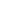
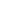
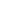

import { Aside } from '@astrojs/starlight/components';

A **scheduled execution** is a one-time run of a workflow or form that you defer to a future moment. It's distinct from a [cron-scheduled workflow](/how-to-guides/workflows/scheduled-workflows/) — cron schedules fire repeatedly forever; deferred executions fire once, then they're done.

Use deferred executions for things like:

- "Disable this user account on Friday at 5 PM"
- "Send the customer their renewal email in 30 days"
- "Run this clean-up workflow tomorrow morning before the team comes in"

## Schedule from the UI

The **Schedule for later** checkbox appears wherever you'd normally hit **Run Now** — the **Execute Workflow** dialog and the **Form Run** view both surface it.



Tick the box and you get two ways to pick the time:

1. **Quick picks** — `In 15 min`, `In 1 hour`, `In 4 hours`, `Tomorrow 9 AM` (uses the browser's local clock for the 9 AM target, sent as an absolute UTC instant).
2. **Specific time picker** — date + time picker for anything else. Minimum is 1 minute in the future; maximum is 1 year out.



If you pick a time in the past (say you fiddle with the picker), the form shows a **Time is in the past** error and the submit button is disabled.

Click **Schedule** and the row is created in `SCHEDULED` status — it appears in **Execution History** with a **Scheduled** badge and the future timestamp.

## How it works

Two pieces cooperate:

1. **Submit** → API creates a `SCHEDULED` row in the `executions` table with `scheduled_at` set; nothing is enqueued yet.
2. **Promoter** → the scheduler service runs a deferred-execution promoter every 60 seconds. It scans for `SCHEDULED` rows whose `scheduled_at` has passed, flips them to `PENDING` in a status-guarded UPDATE, and enqueues them on RabbitMQ. Workers pick them up like any other execution.

The 60-second tick means a job scheduled for `12:00:00` may actually start anywhere from `12:00:00` to `12:00:59`. Plan accordingly — this is not a real-time scheduler.

## Cancel a scheduled execution

While a row is still in `SCHEDULED` status (i.e. before the promoter has flipped it), you can cancel it. From **Execution History**, click the row and use the **Cancel** action — or hit the API directly:

```bash
curl -X POST -H "Authorization: Bearer $TOKEN" \
  "$BIFROST_URL/api/executions/{execution_id}/cancel"
```



The cancel endpoint uses a status-guarded UPDATE: it only succeeds if the row is still `SCHEDULED`. If the promoter beat you to it (the row is already `PENDING` or `RUNNING`), you get **409 Conflict** back with the current status. Cancelling a `RUNNING` execution is a separate feature and is **not** what this endpoint does.

**Authorization:** the original submitter or a platform admin can cancel. Org-scoped rows must match the caller's org.

## Schedule from the API

The same `/api/workflows/{id}/execute` endpoint that runs a workflow now also accepts a `schedule` payload:

```json
{
  "input": { "ticket_id": "T-123" },
  "schedule": {
    "delay_seconds": 3600
  }
}
```

Or with an absolute time:

```json
{
  "input": { "ticket_id": "T-123" },
  "schedule": {
    "scheduled_at": "2026-12-31T17:00:00Z"
  }
}
```

Pick exactly one of `delay_seconds` (positive int, capped at 1 year) or `scheduled_at` (ISO-8601 UTC). The response is the created execution row in `SCHEDULED` status.

## Differences from cron schedules

| | Scheduled execution | Cron schedule |
|---|---|---|
| **Fires** | Once | Repeatedly |
| **Defined where** | Per submission (UI / API) | On the workflow definition (`@workflow(schedule="...")`) |
| **Cancellable per occurrence** | Yes — `/api/executions/{id}/cancel` | No (disable the schedule entirely) |
| **Status** | `SCHEDULED` → `PENDING` → … | `PENDING` → … (no `SCHEDULED` step) |
| **Visible in Execution History** | Yes, with the **Scheduled** badge before it fires | Each run appears as a normal execution at fire time |

If you want a cron-style recurring run, see [Scheduled Workflows](/how-to-guides/workflows/scheduled-workflows/) instead.

## Caveats

- **Restarts are fine.** `SCHEDULED` rows live in Postgres, not in memory or in RabbitMQ. Restarting the scheduler or worker pods doesn't lose them.
- **Time zone:** the API stores `scheduled_at` as UTC. The UI's `Tomorrow 9 AM` quick-pick computes 9 AM in your browser's local clock and converts to UTC at submit time.
- **Granularity:** the promoter polls every 60 seconds. Don't rely on second-level precision.
- **No retroactive runs.** If `scheduled_at` is already in the past at submit time, the API rejects with 400. (The UI prevents this with the **Time is in the past** error.)

## See also

- [Scheduled Workflows](/how-to-guides/workflows/scheduled-workflows/) — recurring cron schedules
- [Diagnostics](/how-to-guides/operations/diagnostics/) — confirm the scheduler is alive
